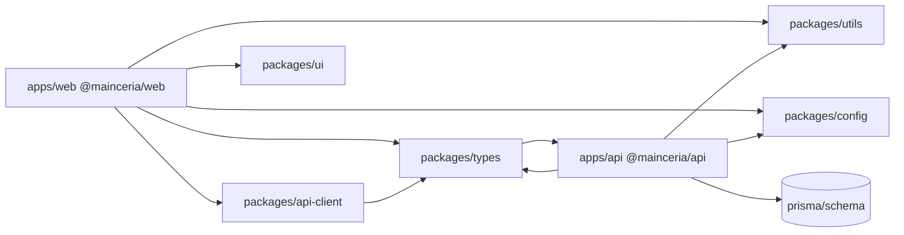

# Game Edukatif Anak

Game edukatif berbasis web untuk anak **TK (4–6 tahun)** dan **SD kelas I (7–8 tahun)** dengan fokus **literasi dasar** dan **matematika dasar** dalam Bahasa Indonesia.

## Menjalankan proyek (development)

Membutuhkan **dua proses**: API Hono (port 3000) dan Vite (port 5173). Proxy `/api` dari Vite mengarah ke API.

```bash
pnpm install
pnpm exec prisma migrate dev # pertama kali / setelah ubah schema (butuh DATABASE_URL)
pnpm db:seed                 # konten level, stiker, badge
pnpm dev                     # menjalankan API + frontend bersamaan
```

Buka **http://localhost:5173**.

- Halaman utama (**`/`**) langsung beranda pemain (mode tamu); tautan **Daftar / Masuk** ada di banner dan di **`/auth/sign-up`** & **`/auth/sign-in`** (akun menyimpan progres di server, maks. **4** profil anak per akun).
- Buat profil anak (TK atau SD-1), lalu main dari dashboard.
- Orang tua: tautan **Orang tua** → setup PIN 4 digit (pertama kali) atau masuk dengan PIN → laporan ringkas.

**Admin panel** (konten/internal): bootstrap **hanya** dengan `pnpm admin:create` — bukan formulir web. Lihat **`/admin/signup`** untuk perintah CLI.

## Stack teknis

| Lapisan   | Teknologi                                      |
| --------- | ---------------------------------------------- |
| Frontend  | Vite, React 19, TanStack Router, Jotai, Tailwind CSS v4 |
| Backend   | Hono (`/api`), Node `@hono/node-server`       |
| Data      | Prisma + PostgreSQL (`DATABASE_URL`)        |
| Validasi  | Zod (server), kontrak di `docs/api-contracts.md` |

**API client (frontend):** permintaan ke `/api/*` memakai **Hono RPC** — `export type AppType` di [`apps/api/src/app.ts`](apps/api/src/app.ts) (disnapshot sebelum mount wildcard better-auth); `createHcApi` / `unwrapData` di **[`packages/api-client`](packages/api-client)** (`@mainceria/api-client`), di web diikat [`apps/web/src/lib/hono-client.ts`](apps/web/src/lib/hono-client.ts) ke [`api-base-url.ts`](apps/web/src/lib/api-base-url.ts); pembungkus domain di [`apps/web/src/api.ts`](apps/web/src/api.ts) dan [`apps/web/src/api-admin.ts`](apps/web/src/api-admin.ts).

> Catatan: Dokumen PRD menyebut **TanStack Start**; implementasi saat ini memakai **Vite + TanStack Router + Hono** terpisah agar stabil dan mudah di-deploy. Perilaku produk mengikuti PRD di folder `docs/`.

## Struktur monorepo (pnpm)

Workspace: **`apps/*`** (API + web) dan **`packages/*`** (tipe, utils, UI, config). Skema Prisma dan skrip global tetap di **root** repo.



Ringkas lokasi penting:

| Lokasi | Isi |
| ------ | ----- |
| `apps/api/src/` | Backend Hono, entry `index.ts` |
| `apps/web/src/` | React + TanStack Router |
| `apps/web/public/` | Aset statis (ikon PWA, stiker SVG, audio) → URL `/…` |
| `packages/api-client/` | `createHcApi`, `unwrapData` — **`@mainceria/api-client`** (dipakai web + tipe `@mainceria/types`) |
| `packages/ui/src/` | Komponen UI bersama (mis. `Button`); konsumen impor **`@mainceria/ui`** |
| `apps/web/vite.config.ts` | Konfig Vite; build menulis **`dist/`** di root untuk Netlify |
| `pnpm dev` | Menjalankan API + frontend ([`scripts/dev.mjs`](scripts/dev.mjs)) |

Perintah per-paket (dari root):

```bash
pnpm --filter @mainceria/api dev
pnpm --filter @mainceria/web dev:vite
pnpm --filter @mainceria/web build
```

Detail checklist migrasi struktur ada di **[docs/recommendations.md §12](docs/recommendations.md)**.

## Deploy frontend (Netlify)

**Domain produksi:** [https://game-edukatif-anak.netlify.app/](https://game-edukatif-anak.netlify.app/)

- Konfigurasi build ada di [`netlify.toml`](netlify.toml) (build → `dist`, fallback SPA).
- **Proxy `/api/*` ke Fly** ada di [`netlify.toml`](netlify.toml) (harus **di atas** fallback `/* → index.html`). Tanpa itu, permintaan `/api` dapat mengembalikan HTML SPA → error *not valid JSON*. Sesuaikan host `to = ...fly.dev` jika nama app Fly berbeda.
- Origin tersebut sudah termasuk di [`apps/api/src/allowed-origins.ts`](apps/api/src/allowed-origins.ts) untuk **CORS** dan **Better Auth** `trustedOrigins`. Tambahan domain/staging: set env **`CORS_ORIGINS`** di server API (pisahkan dengan koma).
- **`VITE_API_URL`** (build Netlify): opsional. Kosongkan jika memakai proxy Netlify di atas; klien memakai [`apiBaseURL()`](apps/web/src/lib/api-base-url.ts) (origin Netlify). Set ke URL API langsung (mis. `https://xxx.fly.dev`) jika **tidak** memakai proxy.
- Pada **server API** (Fly): **`BETTER_AUTH_URL`** harus cocok dengan URL yang dipakai browser untuk auth — jika frontend memakai Netlify + proxy, biasanya **`https://game-edukatif-anak.netlify.app`** (bukan hanya URL Fly). Tetap set **`BETTER_AUTH_SECRET`** (≥32 karakter).

### Sign in with Google (orang tua) — produksi

Tombol Google di UI membaca `googleOAuth` dari **`GET /api/health`** (selalu di-proxy lewat Netlify) atau cadangan `GET /api/app/features`. Nilai `true` hanya jika **keduanya** terisi di **server API** (Fly/Railway), bukan di Netlify build:

| Variabel | Sumber |
| -------- | ------ |
| `GOOGLE_CLIENT_ID` | Client ID dari Google Cloud Console (OAuth 2.0 Client ID tipe **Web application**). |
| `GOOGLE_CLIENT_SECRET` | Client secret pasangan tersebut. |

**Google Cloud Console** ([Credentials](https://console.cloud.google.com/apis/credentials)): buat/edit OAuth client **Web**.

- **Authorized JavaScript origins:** origin yang sama dengan **`BETTER_AUTH_URL`** (tanpa path), mis. `https://game-edukatif-anak.netlify.app`.
- **Authorized redirect URIs:** pastikan ada persis **`{BETTER_AUTH_URL}/api/auth/callback/google`** (tanpa slash di akhir `BETTER_AUTH_URL`).  
  Contoh Netlify + proxy: `https://game-edukatif-anak.netlify.app/api/auth/callback/google`.

Setelah secret diset di Fly/Railway, **wajib `fly deploy`** (atau redeploy Railway) agar kode terbaru membaca env. Verifikasi lewat health (disarankan):

```bash
curl -sS "https://<origin-publik-anda>/api/health"
```

Respons JSON harus memuat `"googleOAuth":true` (bersama `"ok":true`) saat kredensial Google terpasang. Anda juga bisa menguji `curl …/api/app/features` setelah deploy yang memuat rute itu.

## Deploy API (Railway) — Hono + PostgreSQL

1. **Buat project & service** di [Railway](https://railway.app/), hubungkan repo Git yang sama, **Root directory** biarkan root (atau sesuaikan jika monorepo).
2. **Build & start** sudah disetel di [`railway.toml`](railway.toml): build hanya `prisma generate`, start menjalankan `prisma migrate deploy` lalu API (lihat skrip **`start`** di `package.json`). Proses API mendengarkan **`PORT`** (otomatis dari Railway) — lihat [`apps/api/src/index.ts`](apps/api/src/index.ts).
3. **Variabel lingkungan** (tab *Variables* service API):

   | Variabel | Keterangan |
   |----------|------------|
   | `DATABASE_URL` | Connection string PostgreSQL (mis. dari plugin Postgres Railway, atau hostmanaged seperti Prisma Postgres). Harus pakai `sslmode=require` jika penyedia mensyaratkan TLS. |
   | `BETTER_AUTH_URL` | URL publik Railway service ini, mis. `https://xxx.up.railway.app` (tanpa slash akhir). |
   | `BETTER_AUTH_SECRET` | Minimal 32 karakter (acak). |
   | `GOOGLE_CLIENT_ID` / `GOOGLE_CLIENT_SECRET` | Opsional — aktifkan *Sign in with Google* orang tua. |
   | `PIN_HASH_PEPPER` | Sama seperti lokal; jangan kosong di produksi. |
   | `CORS_ORIGINS` | Opsional; domain Netlify sudah default di kode. |

4. **Seed sekali** (opsional): Railway → service → **Shell** / one-off command: `pnpm exec tsx prisma/seed.ts` (setelah migrasi sukses).

5. **Frontend Netlify:** set **`VITE_API_URL`** ke URL publik API Railway agar browser memanggil origin yang benar.

## Deploy API (Fly.io) — Hono + PostgreSQL

Prasyarat: [Fly CLI](https://fly.io/docs/hands-on/install-flyctl/) terpasang dan sudah `fly auth login`.

1. **Inisialisasi app** (sekali, dari root repo):

   ```bash
   fly launch --dockerfile Dockerfile --no-deploy
   ```

   Sesuaikan nama app dan region jika diminta. Field **`app`** di [`fly.toml`](fly.toml) harus sama dengan app Fly Anda.

2. **Secrets wajib** (tanpa ini proses sering **crash / restart** di Fly; dicek di [`apps/api/src/boot-env.ts`](apps/api/src/boot-env.ts)):

   ```bash
   fly secrets set \
     DATABASE_URL="postgres://...@pooled.db.prisma.io/..." \
     DATABASE_DIRECT_URL="postgres://...@db.prisma.io/..." \
     BETTER_AUTH_URL="https://game-edukatif-anak.netlify.app" \
     BETTER_AUTH_SECRET="<minimal-32-karakter-acak>" \
     PIN_HASH_PEPPER="<acak-kuat-terpisah>"
   ```

   Opsional (Google — lihat bagian *Sign in with Google* di atas):

   ```bash
   fly secrets set \
     GOOGLE_CLIENT_ID="....apps.googleusercontent.com" \
     GOOGLE_CLIENT_SECRET="GOCSPX-..."
   ```

   - **`DATABASE_URL`**: dari [Prisma Console](https://console.prisma.io/) → database Anda → **Pooled connection** (untuk runtime Node / `@prisma/client`).
   - **`DATABASE_DIRECT_URL`**: string **Direct connection** yang sama dari dashboard (untuk `prisma migrate deploy` / [`prisma.config.ts`](prisma.config.ts)). Tanpa ini, URL pooled sering memicu **P1001** dari Fly. Salin persis dari Console; host biasanya beda dari pooled (`db.prisma.io` vs `pooled.db.prisma.io`).
   - **`BETTER_AUTH_URL`**: URL yang dipakai **browser** untuk memanggil auth (bukan hanya `*.fly.dev`). Jika frontend di Netlify memakai proxy `/api` ke Fly, isi **URL Netlify** (seperti contoh). Jika klien memanggil API langsung ke Fly, isi `https://<nama-app>.fly.dev`.
   - **`BETTER_AUTH_SECRET`**: panjang **≥ 32** karakter.
   - Cek terpasang: `fly secrets list -a <app>`.

   Opsional: **`CORS_ORIGINS`** jika domain tambahan (pisahkan koma).

3. **Deploy:**

   ```bash
   fly deploy
   ```

4. **Cek:** `curl https://<nama-app>.fly.dev/api/health` harus mengembalikan JSON sukses.

5. **Frontend Netlify:** set **`VITE_API_URL`** ke `https://<nama-app>.fly.dev`.

Image memakai [`Dockerfile`](Dockerfile) (API: `pnpm install --prod`, `prisma generate`, lalu **`pnpm run start:server`**). **`prisma migrate deploy`** dijalankan lewat **[`release_command`](https://fly.io/docs/reference/configuration/#run-one-off-commands-before-releasing-a-deployment)** di [`fly.toml`](fly.toml) agar proses HTTP siap sebelum health check. Jika deploy masih time out, coba `fly deploy` sekali lagi (gangguan API Fly) atau `fly scale count 1` bila app membuat lebih dari satu mesin.

## Dokumentasi produk

| Dokumen                                 | Isi                              |
| --------------------------------------- | -------------------------------- |
| [docs/PRD.md](docs/PRD.md)              | Requirement & alur pengguna      |
| [docs/architecture.md](docs/architecture.md) | Arsitektur target             |
| [docs/database-schema.md](docs/database-schema.md) | Skema data             |
| [docs/content-design.md](docs/content-design.md)   | Jenis mini-game & seed       |
| [docs/PRD-feature-feedback-confetti-math-bank.md](docs/PRD-feature-feedback-confetti-math-bank.md) | PRD penambahan: confetti + SFX salah & bank soal matematika Level 1–3 |

## Script berguna

```bash
pnpm dev             # API + Vite (lihat juga dev:api / dev:vite)
pnpm build           # frontend → ./dist/, lalu prisma generate untuk API
pnpm preview        # tes bundle statik setelah build
pnpm check           # biome + tsc (@mainceria/web, @mainceria/api, @mainceria/api-client)
pnpm db:migrate      # jika memakai migrate (opsional)
pnpm --filter @mainceria/web build
pnpm --filter @mainceria/api dev
```

## Lisensi

Private — sesuaikan dengan kebutuhan Anda.
