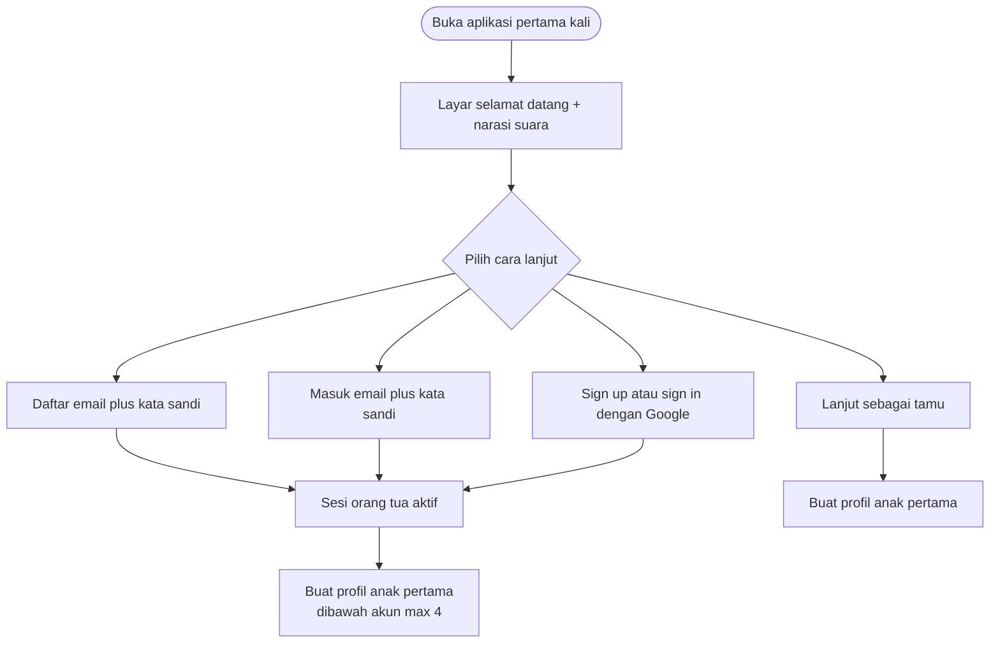
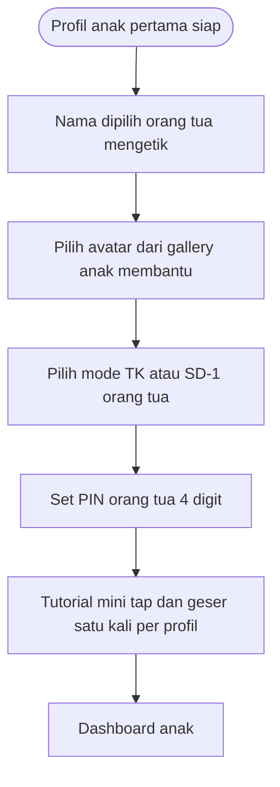
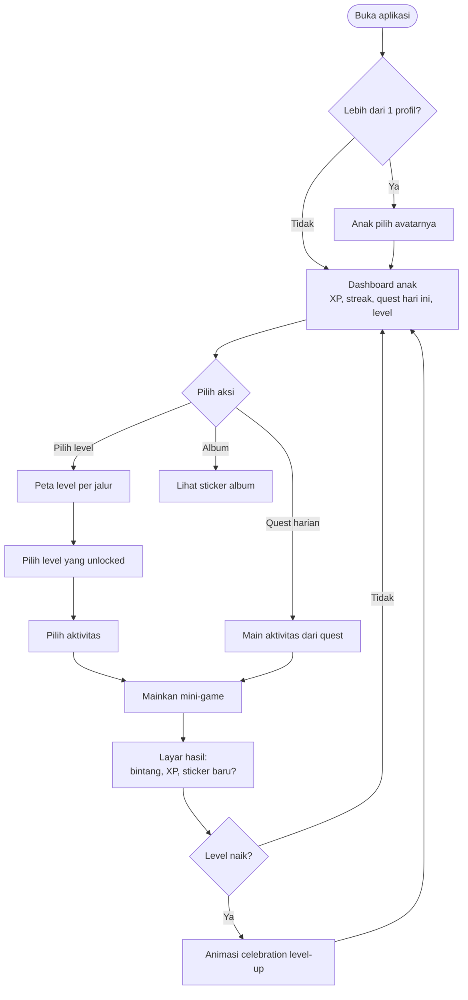
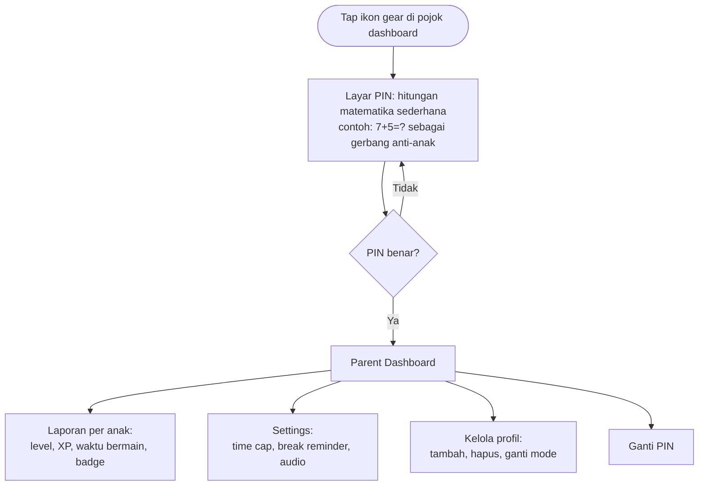
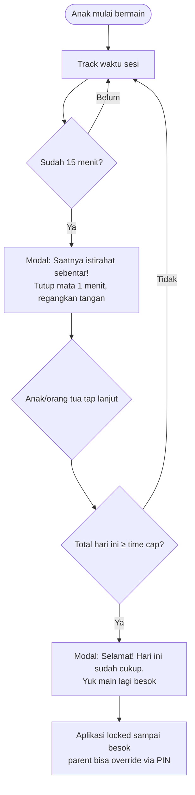

# PRD — Game Edukatif Anak (TK & SD Kelas I)

**Versi**: 1.1 (revisi: akun orang tua & onboarding)
**Status**: Draft untuk implementasi
**Bahasa konten**: Bahasa Indonesia
**Platform**: Web (PWA)

---

## 1. Executive Summary

**Apa**: Aplikasi web edukatif berbasis game untuk anak usia 4–8 tahun yang mengajarkan literasi dasar dan matematika dasar dalam Bahasa Indonesia. Disajikan sebagai serangkaian mini-game pendek (3–8 menit per aktivitas) dengan sistem level bertingkat berbasis penguasaan (mastery), bintang/stiker reward, dan poin XP.

**Untuk siapa**:
- **Pengguna utama**: anak TK (4–6 tahun) & anak SD kelas I (7–8 tahun).
- **Pengguna sekunder**: orang tua / wali yang ingin memantau progres dan mengatur batas waktu bermain.

**Kenapa**: Aplikasi pembelajaran anak yang ada saat ini (Lingokids, Duolingo ABC) sebagian besar berbahasa Inggris dan tidak mengikuti kurikulum lokal. Konten dalam Bahasa Indonesia yang ramah anak, dengan kualitas pedagogis Montessori dan vibe gamifikasi modern, masih jarang.

**Progres disimpan**: mendukung **mode tamu** (progres hanya di perangkat; berisiko hilang jika data browser dibersihkan) dan **mode akun orang tua** (daftar dengan email/kata sandi atau Google; progres profil anak disimpan di server sehingga selaras antar-perangkat saat online). Setelah masuk, **maksimal 4 profil anak per akun**.

**Pendekatan inti**:
- Lini belajar bertingkat berbasis **mastery** (Montessori).
- Reward **bintang & stiker** per aktivitas (Lingokids).
- **XP & streak harian** sederhana (Duolingo).
- **Tema mingguan** sebagai wadah konten (Sekolah Mentari).

**Success metrics ringkas (target 6 bulan post-launch)**:
- ≥60% completion rate untuk Level 1 di kedua jalur.
- ≥40% retensi 7-hari (D7).
- Rata-rata ≥2 dari 3 bintang per aktivitas yang diselesaikan.
- Rata-rata sesi 8–15 menit (sweet spot anak usia 4–8).

---

## 2. Target User & Persona

### 2.1 Persona Anak

#### Persona A — Lala (5 tahun, TK B)

- **Kemampuan**: belum lancar membaca, sudah mengenal huruf besar A–Z, bisa hitung 1–10 dengan jari.
- **Motorik**: bisa drag & drop sederhana di tablet, sentuhan jari kadang tidak presisi.
- **Atensi**: 5–8 menit per aktivitas sebelum bosan.
- **Kebutuhan**: instruksi suara di setiap layar, ikon/gambar besar, feedback langsung yang menyenangkan.
- **Tidak butuh**: teks panjang, tombol kecil, penalty waktu, sistem skor kompetitif.

#### Persona B — Bima (7 tahun, SD-1)

- **Kemampuan**: sudah bisa membaca kata pendek, mulai memahami kalimat sederhana, hitung 1–20, penjumlahan & pengurangan dasar.
- **Motorik**: sudah lebih presisi, bisa drag dengan akurat.
- **Atensi**: 8–15 menit per aktivitas.
- **Kebutuhan**: tantangan yang bertahap, sense of achievement (badge, level up), variasi aktivitas.
- **Tidak butuh**: konten terlalu "bayi" atau terlalu sulit (frustrasi).

### 2.2 Persona Orang Tua

#### Persona C — Bu Sari (32 tahun, ibu Lala)

- **Tujuan**: anak belajar sambil bermain dengan aman (tanpa iklan, tanpa interaksi orang asing).
- **Kebiasaan**: memberi anak gadget 20–30 menit/hari, sering tidak sempat memantau detail.
- **Kebutuhan**: dashboard sederhana untuk melihat "anak saya sudah belajar apa hari ini" dan kontrol batas waktu; opsional **akun** agar progres tidak hilang saat ganti perangkat.
- **Tidak butuh**: laporan analitik kompleks, fitur sosial.

---

## 3. Learning Goals (Mini-Kurikulum)

Mengacu pada Capaian Pembelajaran Fase A & Fase Fondasi (Kurikulum Merdeka Indonesia).

### 3.1 Jalur Literasi

| Mode    | Capaian Inti                                                                                                     |
| ------- | ---------------------------------------------------------------------------------------------------------------- |
| **TK**  | Mengenal bentuk huruf (A–Z, kapital), bunyi huruf, suku kata sederhana (ba, bi, bu, be, bo), kata benda dekat.   |
| **SD-1**| Membaca suku kata kompleks, kata 2–4 huruf, kalimat pendek 2–4 kata, mengenal huruf kecil, mengenal tanda baca dasar. |

### 3.2 Jalur Matematika

| Mode    | Capaian Inti                                                                                                                          |
| ------- | ------------------------------------------------------------------------------------------------------------------------------------- |
| **TK**  | Mengenal angka 1–10, membilang banyak benda, membandingkan jumlah (lebih banyak / lebih sedikit / sama), klasifikasi bentuk & warna. |
| **SD-1**| Bilangan 1–20, penjumlahan & pengurangan dasar (hasil ≤20), mengenal urutan bilangan, perbandingan dengan simbol "<", ">", "=".       |

---

## 4. Pedagogical Principles

Empat prinsip yang harus tercermin di setiap fitur:

1. **Mastery before progression (Montessori)**
   Anak baru bisa membuka level berikutnya setelah mendapat minimal 2 bintang di **semua** aktivitas level saat ini. Ini mendorong pemahaman, bukan kecepatan.

2. **Repeat without shame (Montessori)**
   Anak bebas mengulang aktivitas yang sudah selesai. Setiap pengulangan mungkin meningkatkan jumlah bintang (best score) tetapi tidak pernah menurunkannya.

3. **Visible & frequent rewards (Lingokids)**
   Setiap aktivitas memberi bintang segera. Setiap N bintang membuka stiker baru di album. Setiap level-up memunculkan animasi celebration.

4. **Daily light habit (Duolingo)**
   Quest harian ringan (1–2 aktivitas per jalur per hari) + streak counter. Streak tidak menghukum (tidak hilang permanen jika satu hari libur), hanya reset hitungan.

---

## 5. MVP Scope

### 5.1 In-Scope (MVP)

| Kategori          | Item                                                                                                                |
| ----------------- | ------------------------------------------------------------------------------------------------------------------- |
| Mode pengguna     | TK (4–6) & SD-1 (7–8)                                                                                               |
| Jalur belajar     | Literasi & Matematika                                                                                               |
| Konten            | 3 level pertama × 2 jalur × 2 mode = **12 level**, masing-masing 1–2 aktivitas (total ~18 aktivitas)                |
| Jenis mini-game   | 7 jenis (lihat [content-design.md](content-design.md))                                                              |
| Profil anak       | Multi-profil: **tamu** max 4 per perangkat (progres lokal); **ber-akun** max 4 per akun orang tua (progres server)   |
| Akun orang tua    | Daftar/masuk: **email + kata sandi** atau **Google**; sesi server (cookie); keluar dari akun                       |
| Reward            | Bintang per aktivitas (1–3), XP, streak harian sederhana, sticker album, badge dasar                                |
| Audio             | Voice-over Bahasa Indonesia untuk semua instruksi & feedback aktivitas                                              |
| Parent area       | Dilindungi PIN 4 digit; berisi laporan progres per anak, pengaturan time cap & break reminder                        |
| Onboarding        | Lihat §5.3 & §8.1: gate selamat datang (tamu vs akun), buat profil, PIN orang tua, tutorial mini anak (default ID)   |
| Wellness          | Reminder break tiap 15 menit (default), daily time cap (default 30 menit)                                           |
| Offline           | PWA installable; semua asset & konten level di-cache, bisa main tanpa internet setelah load pertama                 |
| Settings          | Toggle musik, toggle SFX, atur volume, atur reminder, ganti avatar                                                  |

### 5.2 Out-of-Scope (untuk MVP, masuk roadmap)

- Bilingual (Inggris).
- Level 4–10 (akan ditambah bertahap).
- Provider login sosial selain **Google** (Apple, Facebook, dll.) kecuali ditambah di phase berikutnya.
- **Migrasi otomatis** progres tamu → akun (bisa ditunda; lihat §5.3).
- Achievement/leaderboard sosial.
- Konten sains, sosial, atau seni.
- AI tutor / personalisasi adaptif berbasis ML.
- Pembelian dalam aplikasi / monetisasi.

### 5.3 Akun orang tua, mode tamu, dan penyimpanan progres (disarankan untuk rilis setelah inti permainan)

**Tujuan**: orang tua dapat **menyimpan progres** profil anak di server; tanpa akun, aplikasi tetap dapat dipakai dengan progres **hanya pada perangkat**.

**Mode pengguna**:

| Mode | Siapa yang daftar/masuk | Batas profil anak | Sumber kebenaran progres |
| ---- | ------------------------ | ----------------- | ------------------------ |
| Tamu | Tidak                    | Max 4 per **cookie tamu** per peramban               | Progres di server tetapi **scoped** ke perangkat/peramban (cookie `kid_guest_binding`); tidak ikut akun orang tua / tidak antar-akun |
| Akun | Orang tua (bukan anak)   | Max **4 total** per akun | Server; perlu sesi sah. **Offline + akun**: kirim aktivitas tetap membutuhkan jaringan; tanpa itu simpan tidak diperbarui (antrian klien = backlog). |

**Autentikasi orang tua** (bukan alur untuk anak kecil):

- **Daftar**: form email, kata sandi (kekuatan minimal + konfirmasi), centang syarat & kebijakan privasi.
- **Masuk**: email + kata sandi; tautan/pemulihan kata sandi (sesuai kemampuan stack auth).
- **Google**: satu tombol *Sign up / Sign in with Google* (OAuth).
- Tidak ada leaderboard atau profil publik anak berdasarkan email orang tua.

**Aturan bisnis**:

- Pembuatan profil anak ke-5 untuk akun yang sama ditolak dengan pesan jelas (dan kode kesalahan API konsisten).
- Semua endpoint yang menulis **progres** untuk mode akun wajib memverifikasi: `childProfile` milik `userId` sesi tersebut (otorisasi per sumber daya).

**Onboarding penyelarasan** (urutan tinggi):

1. **Layar pembuka orang tua**: nilai aplikasi singkat + tiga jalur eksplisit: **Daftar**, **Masuk**, **Lanjut sebagai tamu** (tamu boleh dijelaskan sebagai “simpanan hanya di perangkat ini”).
2. **Jalur akun (pertama kali setelah daftar/masuk Google)**: buat profil anak pertama (nama, avatar, mode TK/SD-1), lalu tetap **`Set PIN orang tua` (4 digit)**, lalu **tutorial mini anak** (tap/geser — perilaku sama dengan implementasi sekarang per `childId`).
3. **Jalur tamu**: langsung buat profil (sama secara UX seperti sekarang) → PIN sama seperti §8.3 → tutorial anak.

**Migrasi tamu → akun** (opsional backlog): tidak wajib rilis pertama; jika dilakukan, definisikan apakah merge per profil atau “mulai bersih” untuk menghindari konflik ID.

**Catatan implementasi (repo)**: `ChildProfile` memiliki `ownerUserId` (akun orang tua) dan `guestBindingId` (tamu + cookie HttpOnly). Pendaftar better-auth publik memakai `role: parent`; admin bootstrap lewat `pnpm admin:create`. Rincian API: [api-contracts.md](api-contracts.md).

---

## 6. Sistem Level & Progression

### 6.1 Struktur

```
Mode (TK | SD-1)
 └─ Jalur (Literasi | Matematika)
     └─ Level 1, 2, 3 (MVP) … hingga Level 10 (post-MVP)
         └─ Aktivitas 1, 2 (mini-game)
```

### 6.2 Aturan Mastery & Unlock

- **Level 1 selalu unlocked** untuk semua jalur saat profil dibuat.
- **Level N+1 unlocked** ketika anak mendapat **minimal 2 bintang** di **setiap** aktivitas Level N.
- **Mastered**: level dianggap "mastered" jika semua aktivitasnya mendapat 3 bintang. Level mastered ditandai dengan ikon mahkota.
- **Progress bar level**: persentase aktivitas yang sudah selesai (terlepas dari jumlah bintang). Misal 1 dari 2 aktivitas selesai = 50%.

### 6.3 Skema Bintang per Aktivitas

| Bintang | Kriteria (default — bisa di-tune per aktivitas)              |
| ------- | ------------------------------------------------------------ |
| ⭐       | Selesaikan aktivitas (terlepas dari jumlah salah)            |
| ⭐⭐      | Selesai dengan ≤2 kesalahan                                  |
| ⭐⭐⭐     | Selesai tanpa kesalahan                                      |

**Catatan**: tidak ada batasan waktu. Anak bisa berpikir selama yang dia mau.

---

## 7. Sistem Reward

### 7.1 Bintang

- 1–3 per aktivitas, hanya nilai **terbaik** yang disimpan (best score).
- Mengulang aktivitas tidak akan menurunkan bintang yang sudah didapat.

### 7.2 XP (Experience Points)

| Sumber                                        | XP    |
| --------------------------------------------- | ----- |
| Selesai aktivitas pertama kali                | 20    |
| Per bintang yang didapat                      | +5    |
| Bonus streak harian (≥1 aktivitas/hari)       | +10   |
| Selesaikan semua quest harian                 | +15   |
| Naik level                                    | +50   |
| Mengulang aktivitas (sudah pernah selesai)    | +5    |

XP bersifat **kumulatif sepanjang umur profil**, tidak pernah berkurang. Digunakan untuk menampilkan "Level Petualang" anak (level akun, berbeda dari level konten).

### 7.3 Sticker Album

- Setiap kelipatan **10 bintang baru** mengunlock 1 stiker random dari catalog (rarity: common 70%, rare 25%, epic 5%).
- Stiker dipajang di "Album Stikerku" yang bisa dibuka dari dashboard anak.
- Stiker bertema: hewan, makanan, transportasi, tumbuhan, profesi (sesuai kurikulum tematik).

### 7.4 Badge

| Badge                  | Kriteria                                              |
| ---------------------- | ----------------------------------------------------- |
| Petualang Pertama      | Selesaikan aktivitas pertama                          |
| Bintang Tiga           | Dapatkan 3 bintang pertama di satu aktivitas          |
| Streak 3 Hari          | Bermain 3 hari berturut-turut                         |
| Streak 7 Hari          | Bermain 7 hari berturut-turut                         |
| Master Literasi 1      | Mastered semua aktivitas Level 1 Literasi             |
| Master Matematika 1    | Mastered semua aktivitas Level 1 Matematika           |
| Kolektor Pemula        | Kumpulkan 5 stiker                                    |

### 7.5 Streak Harian

- Streak bertambah jika anak menyelesaikan **≥1 aktivitas** dalam satu hari kalender (waktu lokal).
- Jika lewat 1 hari tanpa main, streak **reset ke 0** (sederhana, tanpa "freeze item" untuk MVP).
- Tidak ada notifikasi push (tidak applicable untuk web anak), tidak ada penalty visual yang menyalahkan anak.

---

## 8. User Flows

### 8.1 Onboarding (First Time)

**Prinsip**: orang tua memutuskan **tamu vs akun** sebelum progres “awan” relevan; anak hanya melewati **tutorial interaksi** setelah profil ada.

#### 8.1.1 Gerbang pembuka (orang tua)



#### 8.1.2 Setelah profil pertama ada (kedua jalur)



**Salinan UI**: jalur akun bisa menambahkan satu kalimat bahwa **progres tersimpan ke akun**; jalur tamu menampilkan pengingat ringan (“Progres hanya di perangkat ini”) tanpa menghukum.

**Bahasa aplikasi konten**: default Bahasa Indonesia; pemilih bahasa bisa tetap backlog jika belum ada di UI.

### 8.2 Daily Play Loop



### 8.3 Parent Area (PIN-protected)



### 8.4 Wellness Flow (Background)



---

## 9. Mini-Game Catalog (MVP)

Detail lengkap di [content-design.md](content-design.md). Ringkasan 7 jenis:

| #  | Nama                       | Jalur     | Mode utama  | Mekanik singkat                                           |
| -- | -------------------------- | --------- | ----------- | --------------------------------------------------------- |
| 1  | Huruf-Gambar Matching      | Literasi  | TK          | Drag huruf ke gambar yang berawalan huruf itu             |
| 2  | Susun Suku Kata            | Literasi  | TK & SD-1   | Susun 2 suku kata jadi kata benda                         |
| 3  | Baca Kalimat Pendek        | Literasi  | SD-1        | Baca kalimat lalu pilih gambar yang sesuai                |
| 4  | Hitung Benda               | Matematika| TK          | Hitung jumlah benda lalu pilih angka jawabannya           |
| 5  | Bandingkan Lebih/Kurang    | Matematika| TK          | Pilih kelompok benda yang lebih banyak/lebih sedikit      |
| 6  | Penjumlahan Visual         | Matematika| SD-1        | Soal "3 + 4 = ?" dengan ilustrasi benda                   |
| 7  | Pengurangan Visual         | Matematika| SD-1        | Soal "7 − 2 = ?" dengan ilustrasi benda                   |

---

## 10. Child Wellness & Accessibility

### 10.1 Wellness

- **Daily time cap default**: 30 menit/hari (bisa diatur 10/20/30/45/60 menit).
- **Break reminder default**: setiap 15 menit (bisa di-toggle off).
- **Tidak ada notifikasi push** ke perangkat (web anak idealnya bebas distraksi).
- **No streaks shaming**: jika lewat 1 hari, streak reset, tapi visualnya netral ("Yuk main lagi hari ini!"), bukan menyalahkan.
- **Auto-pause** jika tab tidak aktif >30 detik di tengah aktivitas.

### 10.2 Accessibility (Anak)

- **Touch target minimal 48×48 px** (mengikuti panduan Material/HIG untuk anak kecil).
- **Kontras warna WCAG AA** (rasio ≥4.5:1 untuk teks, ≥3:1 untuk komponen besar).
- **Audio narasi wajib** untuk setiap instruksi aktivitas (anak TK belum bisa baca).
- **No time pressure punitive**: tidak ada countdown yang menyalahkan jika anak lambat.
- **Animasi reward singkat** (max 2 detik) supaya tidak overstimulating.
- **Toggle reduce motion** di settings (untuk anak yang sensitif animasi).
- **Toggle music & SFX** terpisah; volume bisa diatur.

### 10.3 Accessibility (Orang Tua)

- Parent dashboard mengikuti standar WCAG AA biasa (untuk dewasa).
- PIN gate menggunakan soal matematika sederhana sebagai bonus (memastikan yang masuk benar-benar bisa hitung, bukan anak balita yang tap acak).

---

## 11. Privacy & Compliance

Mengacu pada **UU PDP No. 27 Tahun 2022** Indonesia + best practice global (COPPA, GDPR-K).

### 11.1 Prinsip

1. **Data minimization (anak)**: untuk profil anak, hanya simpan nama panggilan (opsional) & avatar preset; tidak menyimpan foto wajah, rekaman suara anak, lokasi presisi, atau meta yang tidak perlu.
2. **Akun orang tua**: jika dipakai, simpan **email** (dan identitas OAuth yang diberikan Google) sesuai kebutuhan autentikasi; ini **bukan** data profil anak. Kebijakan privasi harus menjelaskan peran orang tua sebagai penanggung jawab akun.
3. **Penyimpanan progres**: **tamu** — progres anak di perangkat klien (lihat §5.3); **akun** — progres server-side dalam database aplikasi dengan kontrol akses per akun.
4. **OAuth Google**: hanya untuk login orang tua; tetap hindari penyisipan pelacakan iklan pada alur bermain anak (bedakan dari produk konsumen Google lain).
5. **No third-party tracker**: tidak ada Google Analytics, Facebook Pixel, atau SDK pihak ketiga pada alur bermain anak. Untuk telemetry agregat, utamakan **opt-in** orang tua jika digunakan.
6. **No ads**: tidak pernah ada iklan, baik pihak ketiga maupun internal.
7. **No social/chat**: tidak ada fitur chat, leaderboard publik, atau interaksi antar pengguna.
8. **No external links**: aplikasi tidak membuka link eksternal saat anak sedang dalam mode anak. Link kebijakan privasi & dukungan hanya dari parent area.

### 11.2 Yang Disimpan vs Tidak Disimpan

| Disimpan                                                        | Tidak Disimpan (target)                    |
| --------------------------------------------------------------- | ------------------------------------------ |
| Nama panggilan anak                                             | Nama lengkap, NIK, alamat                  |
| Avatar (dipilih dari gallery preset)                            | Foto asli anak                             |
| Mode (TK/SD-1) & metadata profil                                | Tanggal lahir aktual anak (kecuali sengaja dikumpulkan di phase lain) |
| Progres belajar server-side jika **ber-akun**                   | Memetakan progres anak ke email publik     |
| Snapshot progres lokal jika **tamu** (perangkat)                | Sync cloud untuk tamu tanpa persetujuan    |
| Waktu bermain (wellness)                                        | Lokasi geografis presisi                   |
| PIN orang tua (di-hash)                                         | PIN plaintext                              |
| Email orang tua & token sesi (jika ber-akun / OAuth)            | Kredensial anak                            |

### 11.3 Hak Pengguna

- **Hak hapus**: orang tua bisa hapus profil anak kapan saja (semua data ter-cascade dihapus dari DB).
- **Hak ekspor**: orang tua bisa download progres anak sebagai JSON (post-MVP).
- **Hak akses**: parent dashboard menampilkan semua data yang disimpan tentang anak.

---

## 12. Success Metrics / KPI

### 12.1 Engagement

| Metrik                            | Target MVP (3 bulan post-launch) |
| --------------------------------- | -------------------------------- |
| Daily Active Profiles (DAP)       | Tracked, baseline                |
| Rata-rata sesi/hari per profil    | 1.2–1.5                          |
| Rata-rata durasi sesi             | 8–15 menit                       |
| Retensi D1                        | ≥60%                             |
| Retensi D7                        | ≥40%                             |
| Retensi D30                       | ≥20%                             |

### 12.2 Learning Outcome

| Metrik                                        | Target              |
| --------------------------------------------- | ------------------- |
| Completion rate Level 1 (per jalur)           | ≥60%                |
| Completion rate Level 3 (per jalur)           | ≥30%                |
| Rata-rata bintang per aktivitas yang selesai  | ≥2 dari 3           |
| % aktivitas yang diulang ≥2 kali              | ≥30% (sehat)        |

### 12.3 Wellness

| Metrik                                                   | Target               |
| -------------------------------------------------------- | -------------------- |
| % sesi yang berakhir karena time cap                     | ≤30% (terlalu tinggi = perlu menaikkan default cap) |
| % parent yang mengaktifkan break reminder                | Tracked, baseline    |
| % parent yang mengubah default time cap                  | Tracked, baseline    |

---

## 13. Risks & Mitigations

| Risiko                                                                     | Severity | Mitigasi                                                                                                  |
| -------------------------------------------------------------------------- | -------- | --------------------------------------------------------------------------------------------------------- |
| Anak frustrasi karena terlalu sulit / mudah                                | High     | Mastery-based unlock + repeat freely; bintang tidak menurun saat ulang. UAT dengan anak nyata di Phase 3. |
| Audio voice-over kualitas rendah (suara robotik / aksen tidak natural)     | High     | Pakai voice talent manusia (atau TTS premium seperti ElevenLabs) untuk voice-over fixed. Hindari Web Speech API native browser di production. |
| Konten level kurang banyak → anak cepat bosan                              | High     | MVP fokus 3 level per jalur; rencana phase berikutnya tambah konten. Konten di-author via JSON, mudah ditambah. |
| Orang tua lupa PIN                                                         | Medium   | Provide "reset PIN" via challenge (misal: jawab pertanyaan setup awal). Atau hapus + buat ulang profil. |
| Salah paham tamu vs akun (kehilangan progres)                              | Medium   | Salinan jelas di gate onboarding + pengaturan; opsional CTA “hubungkan akun” saat migrasi tersedia. |
| OAuth / penyimpanan data anak di bawah akun dewasa (expectation regulatoris) | Medium–High | Konsultasi teks legal; data minimization anak; tidak ada profil publik anak. |
| Anak menemukan cara skip break reminder                                    | Medium   | Modal break tidak bisa di-dismiss instan (delay 5 detik), parent bisa override via PIN.                  |
| SQLite single-file riskan corrupt jika crash                               | Medium   | Aktifkan WAL mode, schedule backup harian via Prisma migrate / cron sederhana di production.             |
| PWA cache stale → anak melihat versi lama setelah update                   | Medium   | Workbox dengan strategi `network-first` untuk shell, `cache-first` untuk asset. Versioning di SW.        |
| Latency render mini-game di device low-end                                 | Medium   | Performance budget: bundle ≤300KB gzipped per route, lazy-load asset per level.                          |
| Keterbatasan kapasitas tim untuk produksi konten (gambar, suara)           | Medium   | Mulai dari asset open-source/CC0 + AI-generated (dengan review manual). Tambah voice talent di Phase 3.  |
| UU PDP berubah / interpretasi baru                                         | Low      | Privacy policy modular, mudah di-update. Data minimization mengurangi exposure.                          |

---

## 14. Glossary

- **Akun orang tua**: kredensial dewasa (email+kata sandi atau Google) yang memiliki hingga 4 profil anak dengan progres server-side.
- **Mode tamu**: bermain tanpa akun; progres anak mengikuti penyimpanan lokal perangkat (§5.3).
- **Profil anak**: identitas anak di aplikasi (nama panggilan + avatar + mode TK/SD-1).
- **Mode**: TK atau SD-1, menentukan tingkat kesulitan dan jenis aktivitas yang tersedia.
- **Jalur**: kategori belajar utama (Literasi atau Matematika).
- **Level**: tingkat dalam satu jalur (Level 1, 2, 3, dst).
- **Aktivitas**: instance konkret mini-game di dalam level.
- **Quest harian**: 1–2 aktivitas yang disuggest oleh sistem untuk dimainkan hari itu.
- **Mastered**: status level ketika semua aktivitas mendapat 3 bintang.
- **Streak**: jumlah hari berturut-turut anak menyelesaikan ≥1 aktivitas.
- **Parent area**: bagian aplikasi untuk orang tua, dilindungi PIN.

---

## 15. Referensi & Inspirasi

- **Lingokids** — vibe reward stiker harian, palet warna ceria, voice-over kuat.
- **Duolingo / Duolingo ABC** — XP, streak, micro-learning 3–5 menit.
- **Sekolah Mentari** — metode 3B (Bermain, Bercerita, Bernyanyi) & tema mingguan.
- **Pendekatan Montessori** — mastery, freedom to repeat, sensorial feedback, learning by doing.
- **Kurikulum Merdeka (Kemendikbudristek)** — Capaian Pembelajaran Fase Fondasi & Fase A untuk SD kelas I.

---

## 16. Lampiran: Dokumen Terkait

- [architecture.md](architecture.md) — arsitektur teknis FE/BE
- [database-schema.md](database-schema.md) — skema data
- [api-contracts.md](api-contracts.md) — kontrak API
- [content-design.md](content-design.md) — desain mini-game konkret
- [design-system.md](design-system.md) — visual & audio guideline
- [roadmap.md](roadmap.md) — pembagian fase pengembangan
- [PRD-feature-feedback-confetti-math-bank.md](PRD-feature-feedback-confetti-math-bank.md) — fitur lanjutan: confetti + SFX salah & bank soal matematika Level 1–3
- [PRD-feature-literasi-question-bank.md](PRD-feature-literasi-question-bank.md) — bank soal literasi: minimal 20 kombinasi per Level 1–3 (TK & SD1)
- [PRD-implementation-status.md](PRD-implementation-status.md) — checklist status implementasi vs PRD & roadmap (hidup, perlu diperbarui tiap rilis)
- [PRD-recommended-backlog-levels-4-10.md](PRD-recommended-backlog-levels-4-10.md) — backlog fitur yang disarankan & ekspansi **Level 4–10** (Literasi & Matematika, TK & SD1)
- [PRD-feature-admin-panel.md](PRD-feature-admin-panel.md) — panel admin (manajemen pengguna, konten, bank soal, analytics, audit log, import/export) dengan otentikasi **better-auth + admin plugin**; dua peran: admin internal (email+password) & super-parent (PIN)
