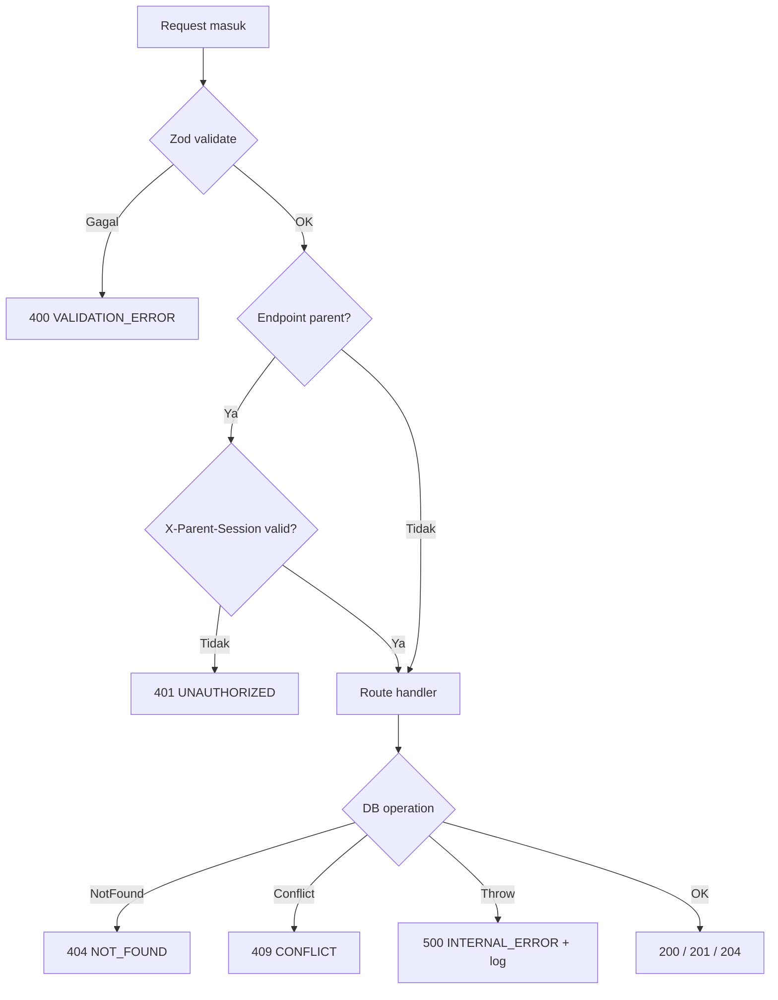

# API Contracts — Game Edukatif Anak

Daftar endpoint Hono yang di-mount di `/api/*`, lengkap dengan Zod schema untuk request & response. Semua schema **didefinisikan satu kali** di `src/server/utils/schemas.ts` dan di-share antara FE & BE.

> Convention: semua endpoint mengembalikan JSON dengan shape `{ data: T }` untuk sukses dan `{ error: { code, message, details? } }` untuk error.

---

## 1. Common Types & Conventions

### 1.1 Standard Response Envelope

```ts
import { z } from 'zod';

export const successResponse = <T extends z.ZodTypeAny>(schema: T) =>
  z.object({ data: schema });

export const errorResponse = z.object({
  error: z.object({
    code: z.enum([
      'VALIDATION_ERROR',
      'NOT_FOUND',
      'UNAUTHORIZED',
      'PIN_INCORRECT',
      'PIN_NOT_SET',
      'CONFLICT',
      'RATE_LIMITED',
      'INTERNAL_ERROR',
    ]),
    message: z.string(),
    details: z.unknown().optional(),
  }),
});
```

### 1.2 HTTP Status Codes

| Code | Penggunaan                                                  |
| ---- | ----------------------------------------------------------- |
| 200  | Sukses (read)                                               |
| 201  | Sukses (create)                                             |
| 204  | Sukses tanpa body (delete)                                  |
| 400  | Validation error (Zod gagal parse request)                  |
| 401  | PIN belum diverifikasi untuk endpoint parent                |
| 403  | PIN salah                                                   |
| 404  | Resource tidak ditemukan                                    |
| 409  | Conflict (misal: nama profil sudah ada)                     |
| 429  | Rate limited (PIN brute force)                              |
| 500  | Internal error                                              |

### 1.3 Authentication

- **Endpoint anak (`/api/profiles`, `/api/activities`, dll.)**: tanpa autentikasi. Lokal device, profil dipilih client-side.
- **Endpoint parent (`/api/parent/*`)**: butuh header `X-Parent-Session: <token>` yang didapat dari `POST /api/parent/verify-pin`. Token in-memory (cleared saat refresh) berlaku selama session, default 30 menit idle.

### 1.4 Shared Schemas

```ts
export const ageModeSchema = z.enum(['TK', 'SD1']);
export const trackSchema = z.enum(['literasi', 'math']);
export const raritySchema = z.enum(['COMMON', 'RARE', 'EPIC']);
export const xpSourceSchema = z.enum([
  'ACTIVITY_COMPLETE',
  'STAR_BONUS',
  'DAILY_STREAK',
  'DAILY_QUEST',
  'LEVEL_UP',
  'REPLAY',
]);
export const activityTypeSchema = z.enum([
  'HURUF_GAMBAR_MATCHING',
  'SUSUN_SUKU_KATA',
  'BACA_KALIMAT_PENDEK',
  'HITUNG_BENDA',
  'BANDINGKAN_LEBIH_KURANG',
  'PENJUMLAHAN_VISUAL',
  'PENGURANGAN_VISUAL',
]);

export const idSchema = z.string().min(1).max(64);
export const childNameSchema = z.string().min(1).max(20).regex(/^[\p{L}\p{M}0-9 '-]+$/u);
export const pinSchema = z.string().regex(/^\d{4}$/);
```

---

## 2. Endpoint: Child Profiles

### 2.1 `GET /api/profiles`

List semua profil anak di device ini.

**Request**: tanpa body.

**Response** (200):
```ts
const childProfileSchema = z.object({
  id: idSchema,
  name: childNameSchema,
  avatarKey: z.string(),
  ageMode: ageModeSchema,
  createdAt: z.string().datetime(),
});

const response = successResponse(z.array(childProfileSchema));
// { data: [ { id, name, avatarKey, ageMode, createdAt }, ... ] }
```

### 2.2 `POST /api/profiles`

Buat profil anak baru.

**Request body**:
```ts
const createProfileSchema = z.object({
  name: childNameSchema,
  avatarKey: z.string().min(1).max(64),
  ageMode: ageModeSchema,
});
```

**Response** (201):
```ts
const response = successResponse(childProfileSchema);
```

**Error**:
- `409 CONFLICT` jika lebih dari 4 profil (max per device).

### 2.3 `PATCH /api/profiles/:id`

Update nama / avatar / mode profil. (Mode change opsional, hanya parent.)

**Request params**: `id`.

**Request body**:
```ts
const updateProfileSchema = z.object({
  name: childNameSchema.optional(),
  avatarKey: z.string().optional(),
  ageMode: ageModeSchema.optional(), // butuh parent session jika diubah
});
```

**Response** (200): `successResponse(childProfileSchema)`.

### 2.4 `DELETE /api/profiles/:id`

Hapus profil + semua data ter-cascade. **Butuh parent session.**

**Headers**: `X-Parent-Session: <token>`.

**Response** (204): no body.

---

## 3. Endpoint: Dashboard

### 3.1 `GET /api/profiles/:id/dashboard`

Data agregat untuk dashboard anak.

**Response** (200):
```ts
const dashboardSchema = z.object({
  child: childProfileSchema,
  totalXp: z.number().int().nonneg(),
  totalStars: z.number().int().nonneg(),
  streak: z.object({
    current: z.number().int().nonneg(),
    longest: z.number().int().nonneg(),
    lastPlayedDate: z.string().nullable(), // "YYYY-MM-DD"
  }),
  tracks: z.array(z.object({
    track: trackSchema,
    currentLevel: z.object({
      id: idSchema,
      order: z.number().int().positive(),
      title: z.string(),
      progressPct: z.number().min(0).max(100), // % aktivitas selesai
    }).nullable(),
    totalLevelsCompleted: z.number().int().nonneg(),
  })),
  todayQuests: z.array(z.object({
    activityId: idSchema,
    activityTitle: z.string(),
    track: trackSchema,
    levelTitle: z.string(),
    isCompleted: z.boolean(),
    estimatedSec: z.number().int().positive(),
  })).max(4),
  recentBadges: z.array(z.object({
    id: idSchema,
    name: z.string(),
    iconPath: z.string(),
    earnedAt: z.string().datetime(),
  })).max(5),
});

const response = successResponse(dashboardSchema);
```

---

## 4. Endpoint: Levels

### 4.1 `GET /api/profiles/:id/levels`

List semua level dengan status unlock per anak.

**Query params**:
```ts
const levelsQuerySchema = z.object({
  track: trackSchema.optional(),
  // ageMode tidak dibutuhkan, otomatis ambil dari profil anak
});
```

**Response** (200):
```ts
const levelWithStatusSchema = z.object({
  id: idSchema,
  track: trackSchema,
  order: z.number().int().positive(),
  title: z.string(),
  description: z.string(),
  iconKey: z.string(),
  isUnlocked: z.boolean(),
  isMastered: z.boolean(),
  progressPct: z.number().min(0).max(100),
  activitiesCount: z.number().int().nonneg(),
  starsEarned: z.number().int().nonneg(), // total bintang dari aktivitas level ini
  starsMax: z.number().int().nonneg(),    // max possible (3 * jumlah aktivitas)
});

const response = successResponse(z.array(levelWithStatusSchema));
```

### 4.2 `GET /api/levels/:levelId`

Detail satu level (untuk halaman level).

**Response** (200):
```ts
const levelDetailSchema = levelWithStatusSchema.extend({
  activities: z.array(z.object({
    id: idSchema,
    type: activityTypeSchema,
    order: z.number().int().positive(),
    title: z.string(),
    estimatedSec: z.number().int().positive(),
    bestStars: z.number().int().min(0).max(3),
    isCompleted: z.boolean(),
  })),
});

const response = successResponse(levelDetailSchema);
```

> **Note**: `:levelId` saja tidak cukup tahu childId. Sebaiknya endpoint ini juga butuh query `?childId=...` atau pindah ke nested route `/api/profiles/:childId/levels/:levelId`. Final keputusan: pakai nested route.

### 4.2.alt `GET /api/profiles/:childId/levels/:levelId`

Path final yang akan dipakai. Schema response sama dengan 4.2.

---

## 5. Endpoint: Activities

### 5.1 `GET /api/activities/:id`

Ambil definisi aktivitas (payload soal, voice-over keys) untuk dirender mini-game.

**Response** (200):
```ts
const activityDefinitionSchema = z.object({
  id: idSchema,
  type: activityTypeSchema,
  title: z.string(),
  estimatedSec: z.number().int().positive(),
  payload: z.unknown(), // tipe tergantung `type`, FE pakai discriminated union
  voiceOverKeys: z.object({
    instruksi: z.string(),
    correct: z.array(z.string()).optional(),
    wrong: z.array(z.string()).optional(),
    completion: z.string().optional(),
  }),
  level: z.object({
    id: idSchema,
    title: z.string(),
    track: trackSchema,
  }),
});

const response = successResponse(activityDefinitionSchema);
```

> Discriminated union untuk `payload` per `type` didefinisikan di [content-design.md](content-design.md).

### 5.2 `POST /api/profiles/:childId/activities/:activityId/submit`

Submit hasil bermain. Server menghitung bintang, XP, sticker baru, badge baru, dan apakah level baru di-unlock/mastered.

**Request body**:
```ts
const submitActivitySchema = z.object({
  score: z.number().int().nonneg(),       // 0..maxScore (per type)
  maxScore: z.number().int().positive(),  // contextual, kirim untuk audit
  mistakes: z.number().int().nonneg(),
  durationSec: z.number().int().positive().max(3600),
  // payload optional untuk debug / replay
  answers: z.array(z.object({
    questionId: z.string(),
    answer: z.unknown(),
    isCorrect: z.boolean(),
  })).optional(),
});
```

**Response** (200):
```ts
const submitResultSchema = z.object({
  stars: z.number().int().min(1).max(3),
  starsImproved: z.boolean(), // true jika best stars bertambah
  xpEarned: z.number().int().nonneg(),
  totalXp: z.number().int().nonneg(),
  newSticker: z.object({
    id: idSchema,
    name: z.string(),
    imagePath: z.string(),
    rarity: raritySchema,
  }).nullable(),
  newBadges: z.array(z.object({
    id: idSchema,
    code: z.string(),
    name: z.string(),
    description: z.string(),
    iconPath: z.string(),
  })),
  levelProgress: z.object({
    progressPct: z.number().min(0).max(100),
    isMastered: z.boolean(),
  }),
  unlockedLevel: z.object({
    id: idSchema,
    title: z.string(),
    track: trackSchema,
  }).nullable(),
  streak: z.object({
    current: z.number().int().nonneg(),
    isNewRecord: z.boolean(),
  }),
});

const response = successResponse(submitResultSchema);
```

---

## 6. Endpoint: Album & Catalog

### 6.1 `GET /api/profiles/:id/stickers`

Album stiker anak (yang sudah didapat + total katalog).

**Response** (200):
```ts
const stickerAlbumSchema = z.object({
  earned: z.array(z.object({
    id: idSchema,
    name: z.string(),
    imagePath: z.string(),
    rarity: raritySchema,
    theme: z.string(),
    earnedAt: z.string().datetime(),
  })),
  totalCatalog: z.number().int().nonneg(),
  byRarity: z.object({
    common: z.object({ earned: z.number(), total: z.number() }),
    rare: z.object({ earned: z.number(), total: z.number() }),
    epic: z.object({ earned: z.number(), total: z.number() }),
  }),
});

const response = successResponse(stickerAlbumSchema);
```

### 6.2 `GET /api/profiles/:id/badges`

Semua badge yang sudah didapat anak.

**Response** (200):
```ts
const badgeListSchema = z.array(z.object({
  id: idSchema,
  code: z.string(),
  name: z.string(),
  description: z.string(),
  iconPath: z.string(),
  earnedAt: z.string().datetime(),
}));

const response = successResponse(badgeListSchema);
```

---

## 7. Endpoint: Parent Area

### 7.1 `POST /api/parent/setup-pin`

Set PIN pertama kali (saat onboarding). Hanya sukses jika `pinHash == null` di DB.

**Request body**:
```ts
const setupPinSchema = z.object({
  pin: pinSchema,
  recoveryQuestion: z.string().min(3).max(100),
  recoveryAnswer: z.string().min(2).max(50),
});
```

**Response** (201):
```ts
const response = successResponse(z.object({
  ok: z.literal(true),
  sessionToken: z.string(),
  expiresAt: z.string().datetime(),
}));
```

### 7.2 `POST /api/parent/verify-pin`

Verifikasi PIN, dapatkan session token.

**Request body**:
```ts
const verifyPinSchema = z.object({
  pin: pinSchema,
});
```

**Response** (200):
```ts
const response = successResponse(z.object({
  sessionToken: z.string(),
  expiresAt: z.string().datetime(),
}));
```

**Rate limit**: max 5 percobaan per 15 menit per device. Jika lewat → `429 RATE_LIMITED`.

### 7.3 `POST /api/parent/recover-pin`

Reset PIN via recovery question (jika lupa PIN).

**Request body**:
```ts
const recoverPinSchema = z.object({
  recoveryAnswer: z.string().min(2).max(50),
  newPin: pinSchema,
});
```

**Response** (200): `successResponse({ ok: true })`.

### 7.4 `POST /api/parent/change-pin`

Ganti PIN (butuh PIN lama).

**Headers**: `X-Parent-Session`.

**Request body**:
```ts
const changePinSchema = z.object({
  oldPin: pinSchema,
  newPin: pinSchema,
});
```

### 7.5 `GET /api/parent/settings`

**Headers**: `X-Parent-Session`.

**Response** (200):
```ts
const parentSettingsSchema = z.object({
  dailyTimeCapMinutes: z.number().int().positive(),
  breakReminderMinutes: z.number().int().positive(),
  musicEnabled: z.boolean(),
  sfxEnabled: z.boolean(),
  reduceMotion: z.boolean(),
});

const response = successResponse(parentSettingsSchema);
```

### 7.6 `PUT /api/parent/settings`

**Request body**:
```ts
const updateSettingsSchema = parentSettingsSchema.partial();
```

**Response** (200): `successResponse(parentSettingsSchema)`.

### 7.7 `GET /api/parent/report/:childId`

Laporan agregat per anak.

**Headers**: `X-Parent-Session`.

**Query params**:
```ts
const reportQuerySchema = z.object({
  range: z.enum(['today', 'week', 'month', 'all']).default('week'),
});
```

**Response** (200):
```ts
const childReportSchema = z.object({
  child: childProfileSchema,
  totalXp: z.number().int().nonneg(),
  totalStars: z.number().int().nonneg(),
  totalActivitiesCompleted: z.number().int().nonneg(),
  totalPlayMinutes: z.number().int().nonneg(),
  streak: z.object({
    current: z.number().int().nonneg(),
    longest: z.number().int().nonneg(),
  }),
  perTrack: z.array(z.object({
    track: trackSchema,
    levelsMastered: z.number().int().nonneg(),
    activitiesCompleted: z.number().int().nonneg(),
    averageStars: z.number().min(0).max(3),
  })),
  recentBadges: z.array(z.object({
    name: z.string(),
    iconPath: z.string(),
    earnedAt: z.string().datetime(),
  })),
  dailyTimeline: z.array(z.object({
    date: z.string(), // YYYY-MM-DD
    minutesPlayed: z.number().int().nonneg(),
    activitiesCompleted: z.number().int().nonneg(),
    xpEarned: z.number().int().nonneg(),
  })),
});

const response = successResponse(childReportSchema);
```

### 7.8 `GET /api/parent/wellness/:childId`

Status wellness anak hari ini.

**Response** (200):
```ts
const wellnessStatusSchema = z.object({
  minutesPlayedToday: z.number().int().nonneg(),
  dailyCapMinutes: z.number().int().positive(),
  capReached: z.boolean(),
  breaksTakenToday: z.number().int().nonneg(),
});

const response = successResponse(wellnessStatusSchema);
```

### 7.9 `POST /api/parent/wellness/override-cap`

Parent override daily cap (sekali pakai untuk hari ini).

**Headers**: `X-Parent-Session`.

**Request body**:
```ts
const overrideCapSchema = z.object({
  childId: idSchema,
  additionalMinutes: z.number().int().min(5).max(60),
});
```

---

## 8. Endpoint: Wellness (Background tracking)

### 8.1 `POST /api/profiles/:childId/sessions/start`

Mulai tracking sesi bermain. Dipanggil saat anak buka aplikasi atau resume dari background.

**Response** (201):
```ts
const sessionStartedSchema = z.object({
  sessionId: idSchema,
  startedAt: z.string().datetime(),
  minutesPlayedToday: z.number().int().nonneg(),
  capReached: z.boolean(),
});

const response = successResponse(sessionStartedSchema);
```

### 8.2 `POST /api/profiles/:childId/sessions/:sessionId/heartbeat`

Heartbeat tiap 30 detik untuk update durasi sesi.

**Request body**: empty.

**Response** (200):
```ts
const heartbeatSchema = z.object({
  durationSec: z.number().int().nonneg(),
  shouldShowBreak: z.boolean(),
  capReached: z.boolean(),
});

const response = successResponse(heartbeatSchema);
```

### 8.3 `POST /api/profiles/:childId/sessions/:sessionId/end`

Akhiri sesi. Dipanggil saat anak tutup aplikasi atau idle.

**Response** (200):
```ts
const sessionEndedSchema = z.object({
  durationSec: z.number().int().nonneg(),
});
```

---

## 9. Implementasi routing Hono (kode nyata)

Sumber kebenaran: `server/app.ts`, `server/admin.ts`, `server/routes/web/`. Rute permainan & orang tua digabung lewat `webApi` (beberapa sub-app Hono), lalu admin di `/api/admin`, lalu better-auth di `/api/auth/*`.

**Entry & komposisi (ringkas):**

```ts
// server/app.ts (disederhanakan)
import { Hono } from 'hono';
import { adminRouter } from './admin';
import { auth } from './auth';
import { webApi } from './routes/web';

const api = new Hono()
  .use(/* cors, prettyJSON */);

api.route('/api/admin', adminRouter);
api.route('/', webApi);

export type AppType = typeof api; // sebelum better-auth

api.on(['POST', 'GET'], '/api/auth/*', (c) => auth.handler(c.req.raw));
export const app = api;
```

- **`export type AppType`** harus **sebelum** `api.on(..., '/api/auth/*', …)` agar tipe klien Hono RPC tidak tercampur wildcard auth.
- **Domain web:** `server/routes/web/index.ts` memasang `profilesCrudApp`, `gameplayApp`, `parentAreaApp` (masing-masing mendefinisikan path penuh `/api/...`).

**Klien frontend** memakai `hono/client` + `AppType`: lihat `src/lib/hono-client.ts`, `src/api.ts`, `src/api-admin.ts`. Detail arsitektur: [architecture.md — Backend & API client (implementasi aktual)](architecture.md#backend--api-client-implementasi-aktual).

> **Sketsa lama (subrouter per resource)** di bawah ini **bukan** struktur folder saat ini; disimpan hanya sebagai referensi pola Hono `app.route` bila nanti dipecah beda lagi.

---

## 10. FE API Client Convention

**Implementasi saat ini** memakai **Hono RPC** (`hc<AppType>`) dan helper `unwrapData` / parser admin, bukan `src/lib/api-client.ts` generik. Path HTTP diselaraskan lewat chain klien, bukan string template manual, di `src/api.ts` dan `src/api-admin.ts`.

Konvensi di bawah ini menggambarkan **pol** pembungkus fetch + TanStack Query yang masih bisa dipakai bersama data dari `api.*`:

- Header `X-Parent-Session` untuk rute orang tua — di-set eksplisit di pemanggilan RPC yang relevan.
- Error dari API mengikuti `{ error: { code, message } }` atau `{ error: string }` (admin); parser ada di `unwrapData` / `parseAdminResponse`.

Contoh penggunaan dengan TanStack Query memanggil modul `api` (bukan string URL manual):

```ts
import { api } from '@/api';

export function useDashboard(childId: string) {
  return useQuery({
    queryKey: ['dashboard', childId],
    queryFn: () => api.getDashboard(childId),
    staleTime: 30_000,
  });
}

export function useSubmitActivity() {
  const queryClient = useQueryClient();
  return useMutation({
    mutationFn: (input: {
      childId: string;
      activityId: string;
      body: {
        score: number;
        maxScore: number;
        mistakes: number;
        durationSec: number;
      };
    }) =>
      api.submitActivity(input.childId, input.activityId, input.body),
    onSuccess: (_data, vars) => {
      queryClient.invalidateQueries({ queryKey: ['dashboard', vars.childId] });
      queryClient.invalidateQueries({ queryKey: ['levels', vars.childId] });
    },
  });
}
```

---

## 11. Error Handling Flow



---

## 12. Versioning & Backward Compatibility

- Semua endpoint di-prefix `/api/` (tanpa `/v1/`) untuk MVP, karena single-app same-origin.
- Jika nantinya ada breaking change post-MVP: pindah ke `/api/v2/...` dan support keduanya selama 1 release cycle.
- Service worker akan invalidate cache lama saat detect endpoint baru (via build hash).

---

## 13. Open Questions

- [x] **Hono RPC client** — `AppType` di `server/app.ts` + `hc` di `src/lib/hono-client.ts` + `api.ts` / `api-admin.ts` (path diselaraskan server; inferensi chain penuh terbatas pada router besar, lihat komentar di `hono-client.ts`).
- [ ] Untuk parent session token: in-memory only, atau persist di sessionStorage (trade-off: convenience vs security)?
- [ ] Heartbeat 30 detik: cukup atau perlu lebih sering (15 detik) untuk tracking lebih akurat?
- [ ] Apakah `submit` harus include semua `answers` untuk audit, atau cukup score+mistakes?
