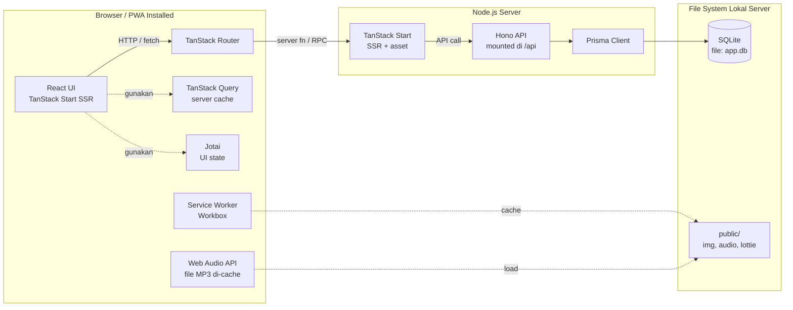
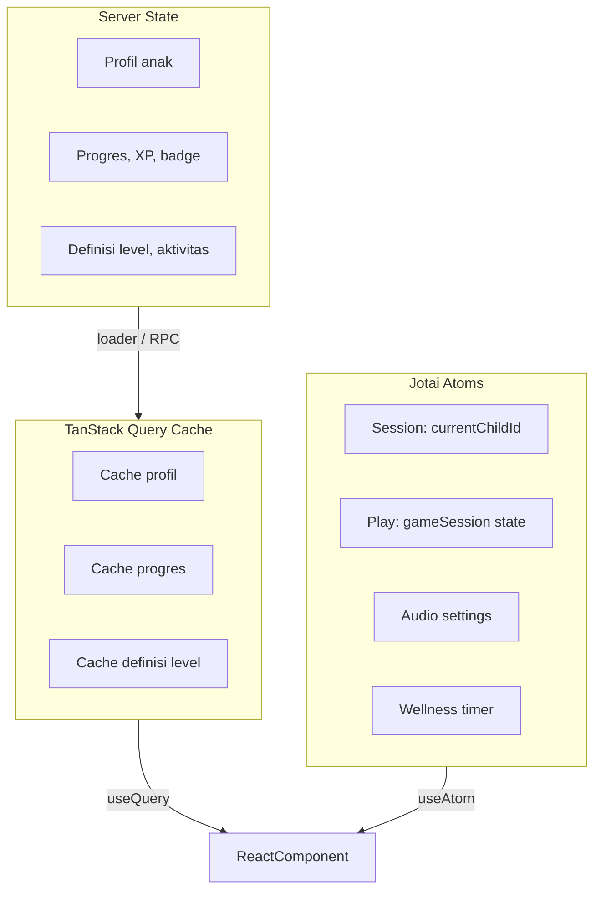
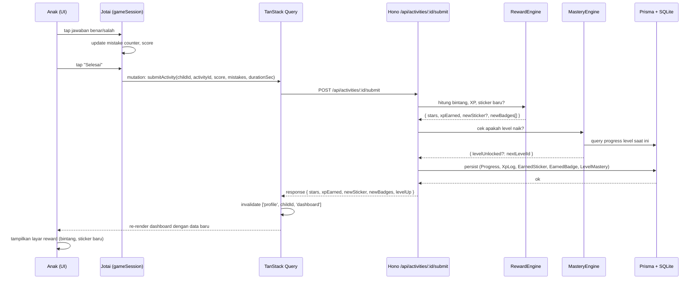
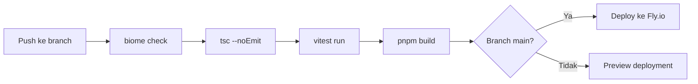

# Architecture — Game Edukatif Anak

Dokumen ini menjelaskan arsitektur teknis aplikasi: stack, struktur proyek, pengelolaan state, alur data, strategi asset & audio, PWA, deployment, dan tooling.

> Untuk skema database dan kontrak API, lihat dokumen terpisah: [database-schema.md](database-schema.md), [api-contracts.md](api-contracts.md).

---

## 1. High-Level Architecture



### Catatan

- **Implementasi saat ini**: proses dev memakai **Vite + Hono terpisah** (proxy `/api` → port API); bukan monolith TanStack Start seperti pada diagram. Diagram di atas menggambarkan **target / alternatif** integrasi SSR.
- **SQLite single-file**: cocok untuk MVP (single-device deployment). Path file DB mengikuti `DATABASE_URL` di `.env` / Prisma (mis. `file:./dev.db`).
- **Service Worker / PWA**: belum menjadi bagian inti alur dev di repo ini; setelah `pnpm build` perilaku static mengikuti Vite.

---

## 2. Project Structure

Single repository, single app. Struktur direkomendasikan:

```
game_edukatif_anak/
├─ docs/                          # Dokumentasi (PRD, dll.)
├─ public/                        # Static asset disajikan apa adanya
│  ├─ img/
│  │  ├─ avatars/                 # Avatar preset (panda, kucing, dll.)
│  │  ├─ stickers/                # Sticker katalog
│  │  ├─ illustrations/           # Ilustrasi aktivitas (apel, sapi, dll.)
│  │  └─ mascot/                  # Asset mascot Bimo
│  ├─ audio/
│  │  ├─ vo/                      # Voice-over (narasi instruksi)
│  │  │  ├─ id/                   # Bahasa Indonesia
│  │  │  └─ ...                   # (post-MVP: en, dll.)
│  │  ├─ sfx/                     # Sound effect (correct, wrong, levelup)
│  │  └─ music/                   # Background music
│  └─ lottie/                     # Animasi Lottie JSON
├─ src/
│  ├─ routes/                     # TanStack Router file-based routes
│  │  ├─ __root.tsx
│  │  ├─ index.tsx                # Landing / profile picker
│  │  ├─ onboarding/
│  │  ├─ profile/$childId/
│  │  │  ├─ dashboard.tsx
│  │  │  ├─ levels.$track.tsx
│  │  │  ├─ play.$activityId.tsx
│  │  │  ├─ result.tsx
│  │  │  └─ album.tsx
│  │  ├─ parent/                  # PIN-protected routes
│  │  │  ├─ index.tsx
│  │  │  ├─ children.tsx
│  │  │  ├─ settings.tsx
│  │  │  └─ change-pin.tsx
│  │  └─ api/                     # Hono mounted di sini
│  │     └─ $.ts                  # Catch-all -> route ke Hono app
│  ├─ server/                     # Backend logic (Hono + Prisma)
│  │  ├─ app.ts                   # Hono app utama, mount semua route
│  │  ├─ routes/
│  │  │  ├─ profiles.ts
│  │  │  ├─ levels.ts
│  │  │  ├─ activities.ts
│  │  │  ├─ parent.ts
│  │  │  └─ wellness.ts
│  │  ├─ services/                # Business logic (rewardEngine, masteryEngine)
│  │  │  ├─ reward-engine.ts
│  │  │  ├─ mastery-engine.ts
│  │  │  └─ streak-engine.ts
│  │  ├─ db/
│  │  │  ├─ client.ts             # Prisma client singleton
│  │  │  └─ seed.ts               # Seed konten level + sticker catalog
│  │  └─ utils/
│  │     ├─ pin.ts                # Hash & verify PIN
│  │     └─ schemas.ts            # Zod schema shared FE/BE
│  ├─ features/                   # FE features (per domain)
│  │  ├─ onboarding/
│  │  ├─ profile/
│  │  ├─ dashboard/
│  │  ├─ play/
│  │  │  ├─ HuruflGambarMatching.tsx
│  │  │  ├─ SusunSukuKata.tsx
│  │  │  ├─ HitungBenda.tsx
│  │  │  └─ ... (per mini-game)
│  │  ├─ reward/
│  │  ├─ album/
│  │  └─ parent/
│  ├─ components/                 # Shared UI components
│  │  ├─ ui/                      # Atomic: Button, Card, Modal
│  │  ├─ feedback/                # StarBurst, Confetti, LevelUpBanner
│  │  └─ mascot/                  # Mascot Bimo + balon dialog
│  ├─ hooks/
│  │  ├─ useAudio.ts              # Hook play VO, SFX, BGM
│  │  ├─ useWellness.ts           # Track time + break reminder
│  │  └─ useChildProfile.ts
│  ├─ state/                      # Jotai atoms
│  │  ├─ session.ts               # currentChildId, currentRoute
│  │  ├─ play.ts                  # gameSession (score, mistakes, attempts)
│  │  ├─ audio.ts                 # musicVolume, sfxVolume, voEnabled
│  │  └─ wellness.ts              # sessionStart, breaksTakenToday
│  ├─ lib/
│  │  ├─ api-client.ts            # Wrapper fetch + Zod parse
│  │  └─ constants.ts
│  ├─ styles/
│  │  └─ globals.css              # Tailwind + custom CSS variables
│  └─ types/
│     └─ index.ts                 # Tipe shared
├─ prisma/
│  ├─ schema.prisma
│  ├─ migrations/
│  └─ seed.ts                     # Entry seed (memanggil src/server/db/seed.ts)
├─ scripts/
│  └─ generate-vo.ts              # Helper batch-generate voice-over (opsional)
├─ tests/
│  ├─ unit/                       # Vitest
│  └─ e2e/                        # Playwright
├─ .husky/
├─ biome.json
├─ tsconfig.json
├─ vite.config.ts                 # (atau app.config.ts untuk TanStack Start)
├─ package.json
├─ pnpm-lock.yaml
├─ .env.example
└─ README.md
```

### Alasan struktur

- **`features/` per domain**: bukan per type (components/, pages/), supaya kode yang related (UI + logic mini-game) berada di satu folder. Lebih maintainable saat tim besar.
- **`server/` di root repo**: backend Hono terpisah dari bundle Vite; share tipe ke frontend lewat `import type` + alias `@server` (bukan import runtime).
- **`hooks/` & `state/` terpisah**: hooks adalah "perilaku React-y", state adalah "data global" (Jotai atoms).

### Backend & API client (implementasi aktual)

Struktur pohon di atas sebagian masih **target**; berikut yang ada di repositori sekarang untuk Hono dan klien API.

**Proses development:** `pnpm dev` menjalankan **dua proses** — API Hono (default port 3000, `server/index.ts`) dan Vite (`vite.config.ts` mem-proxy `/api` ke API). Permintaan browser ke `http://localhost:5173/api/...` diteruskan ke backend.

**Layout `server/` (ringkas):**

```
server/
├─ index.ts                 # @hono/node-server → app.fetch
├─ app.ts                   # root Hono: CORS, prettyJSON, mount admin + web, export AppType, better-auth
├─ admin.ts                 # /api/admin/* (panel admin, RBAC)
├─ auth.ts                  # better-auth
├─ schemas.ts, schemas.admin.ts
├─ routes/web/
│  ├─ index.ts              # menggabungkan sub-app
│  ├─ shared.ts             # jsonErr, parentGuard
│  ├─ profiles-crud.ts      # /api/health, profil anak, reset progres (super-parent)
│  ├─ gameplay.ts           # dashboard, level, aktivitas, submit
│  └─ parent-area.ts        # PIN, settings orang tua, laporan
├─ services/                # dashboard, submit-activity, mastery, admin-analytics, …
└─ db.ts, audit.ts, pin.ts, parent-session.ts, …
```

**Hono RPC (frontend):** `export type AppType = typeof api` di `server/app.ts` diposisikan **setelah** mount route admin & web, **sebelum** `api.on(['POST','GET'], '/api/auth/*', …)`. Wildcard better-auth harus **tidak** ikut ke snapshot tipe agar klien `hc<AppType>()` tetap masuk akal. Klien: `src/lib/hono-client.ts` (`hc`, `unwrapData` untuk respons `{ data: T }`), pembungkus domain `src/api.ts` dan `src/api-admin.ts`. Alias `@server` di `tsconfig.json` + `vite.config.ts` mendukung `import type { AppType } from '@server/app'` tanpa mengimpor runtime server ke bundle.

**Keterbatasan tipe:** inferensi chain `hc<AppType>()` pada gabungan router besar sering jatuh ke `unknown` di TypeScript; satu assertion terpusat di `hono-client.ts` (dengan komentar) — jangan menambah duplikasi path string di luar `api.ts` / `api-admin.ts`.

**Troubleshooting singkat**

| Gejala | Periksa |
| --- | --- |
| Cookie admin tidak terkirim | Request same-origin lewat Vite; `credentials: 'include'` sudah di `hono-client` |
| CORS error | Origin browser harus masuk daftar `cors()` di `server/app.ts` |
| `AppType` / import `@server/app` | Pastikan alias `@server` di Vite selaras dengan `tsconfig` paths |

---

## 3. State Management Strategy

### 3.1 Tiga Lapisan State



### 3.2 Pembagian Tugas

| Lapisan          | Tools                                    | Isi                                                                |
| ---------------- | ---------------------------------------- | ------------------------------------------------------------------ |
| Server state     | TanStack Query (built-in TanStack Start) | Data dari API: profil, progres, definisi level                     |
| UI/global state  | Jotai                                    | `currentChildId`, `gameSession`, audio settings, wellness timer    |
| Form state       | Zod + react-hook-form (opsional)         | Form input nama, PIN                                               |
| Route state      | TanStack Router (search params)          | Filter level (`?track=literasi&mode=TK`)                           |

### 3.3 Aturan Praktis

- **Jangan duplikat server data ke Jotai**. Ambil dari TanStack Query cache.
- **Optimistic update** untuk reward (anak harus melihat bintang langsung muncul, sebelum BE merespon).
- **Persist Jotai** untuk audio settings & last selected child via `atomWithStorage` (localStorage).
- **Gameplay state** (mistake counter, current question index, dll) di Jotai dengan `atomFamily(activityId)` supaya bisa multi-aktivitas tanpa state collision.

---

## 4. Data Flow — Submit Aktivitas (Contoh Konkret)



---

## 5. Audio Strategy

### 5.1 Tiga Jenis Audio

| Jenis              | Sumber                                                        | Loading                            |
| ------------------ | ------------------------------------------------------------- | ---------------------------------- |
| **Voice-over (VO)**| File MP3 statis hasil rekam manusia / ElevenLabs              | Preload per aktivitas saat masuk   |
| **SFX**            | File MP3/OGG pendek (correct, wrong, levelup, click)          | Preload semua di app start         |
| **BGM**            | File MP3 looping, ringan (<1MB), playful instrumental          | Lazy load saat masuk dashboard     |

### 5.2 Implementasi

- Pakai **Web Audio API** via custom hook `useAudio()`:
  ```ts
  const { play, stop, preload } = useAudio();
  play('vo/id/instruksi-huruf-gambar-1.mp3');
  ```
- **Tidak pakai `<audio>` element langsung** karena perlu kontrol concurrent playback (BGM + SFX + VO bisa main bersamaan).
- **Mute saat aplikasi tidak focus**: pakai `document.visibilitychange` listener.
- **Fallback Web Speech API**: HANYA untuk konten dinamis (misal nama anak), JANGAN untuk instruksi tetap (kualitas rendah).

### 5.3 Asset Naming Convention

```
public/audio/vo/id/
├─ ui/                            # narasi UI umum
│  ├─ welcome.mp3
│  ├─ pilih-mode.mp3
│  └─ break-time.mp3
├─ activity/
│  ├─ huruf-gambar-matching/
│  │  ├─ instruksi.mp3
│  │  ├─ correct-1.mp3
│  │  ├─ wrong-1.mp3
│  │  └─ ...
│  └─ ...
└─ feedback/
   ├─ great.mp3
   ├─ try-again.mp3
   └─ celebration.mp3
```

---

## 6. Asset Strategy

### 6.1 Format & Pemilihan

| Tipe Asset          | Format                | Alasan                                            |
| ------------------- | --------------------- | ------------------------------------------------- |
| Ikon UI             | Inline SVG            | Skalabel, kecil, bisa di-style via CSS            |
| Ilustrasi (apel, dll)| WebP (fallback PNG)  | Kompresi 30–40% lebih baik dari PNG               |
| Avatar preset       | SVG atau PNG 256×256  | Konsisten, mudah di-render                        |
| Sticker             | PNG 512×512 transparent | Detail bagus, transparent untuk overlay          |
| Animasi reward      | Lottie JSON           | Lebih ringan dari MP4, scalable                   |
| Mascot              | SVG / Lottie          | Bisa di-animasikan tanpa file besar               |

### 6.2 Performance Budget

| Metric                           | Target               |
| -------------------------------- | -------------------- |
| Initial JS bundle (gzipped)      | ≤ 250 KB             |
| Initial CSS                      | ≤ 50 KB              |
| Image per aktivitas (rata-rata)  | ≤ 100 KB             |
| Total asset cache (PWA)          | ≤ 30 MB              |
| Time to Interactive (3G slow)    | ≤ 5 detik            |

### 6.3 Lazy Loading

- **Per route**: TanStack Router otomatis code-split per file route.
- **Per aktivitas**: image & VO aktivitas hanya dipreload saat user masuk halaman aktivitas.
- **Mini-game component**: dynamic import per type (`HuruflGambarMatching`, dll) supaya bundle awal tidak balon.

---

## 7. PWA & Offline Strategy

### 7.1 Service Worker (Workbox)

| Resource Type          | Strategy           | Alasan                                                    |
| ---------------------- | ------------------ | --------------------------------------------------------- |
| HTML shell             | `NetworkFirst`     | Selalu cek versi baru, fallback ke cache jika offline     |
| JS/CSS assets          | `CacheFirst` + revision | Versioned via build hash                              |
| Image (`/img/*`)       | `CacheFirst`       | Jarang berubah, hemat bandwidth                           |
| Audio (`/audio/*`)     | `CacheFirst`       | File besar, harus di-cache agresif                        |
| Lottie JSON            | `CacheFirst`       |                                                           |
| API calls (`/api/*`)   | `NetworkOnly`      | Selalu fresh; jika offline, tampilkan banner "kamu offline" |

### 7.2 Install Prompt

- Custom UI prompt "Pasang Game Edukatif Anak" yang muncul setelah onboarding selesai (bukan langsung browser default).
- Ikon & nama PWA menggunakan asset mascot Bimo.

### 7.3 Offline UX

- Jika offline & user mencoba aktivitas baru yang belum dicache: tampilkan modal "Aktivitas ini perlu internet untuk pertama kali. Yuk konek dulu!".
- Sinkronisasi progres: untuk MVP, semua progres tersimpan langsung saat online (tidak ada queue offline). Post-MVP: tambah outbox pattern.

---

## 8. Deployment

### 8.1 Rekomendasi Infra MVP

| Komponen              | Pilihan                          | Alasan                                                         |
| --------------------- | -------------------------------- | -------------------------------------------------------------- |
| Hosting               | **Fly.io** atau **Railway** atau VPS sederhana | Mendukung persistent volume untuk SQLite                       |
| Database              | SQLite file di persistent volume | Sederhana, sufficient untuk single-instance MVP                |
| CDN (opsional)        | Cloudflare di depan host         | Hemat bandwidth audio/image                                    |
| Domain                | Custom domain + HTTPS via Let's Encrypt | Wajib untuk PWA                                          |

### 8.2 Migrasi Skala (Post-MVP)

Jika nantinya butuh multi-region atau sync cloud:
- Migrasi ke **Turso** (libSQL = SQLite-compatible, distributed).
- Atau migrasi ke **PostgreSQL + Neon** (serverless), butuh adjust Prisma schema (cuid → uuid OK).

### 8.3 CI/CD

GitHub Actions pipeline:



### 8.4 Backup

- Cron daily: copy `app.db` ke storage backup (S3 / Backblaze B2).
- Retention: 7 harian + 4 mingguan.
- Restore drill manual minimal sekali per bulan.

---

## 9. Tooling

### 9.1 Package Manager

- **pnpm** dengan `pnpm-workspace.yaml` (single package untuk MVP, siap diperluas).
- Versi node: lock di `.nvmrc` (rekomendasi: Node 20 LTS).

### 9.2 BiomeJS

`biome.json` dengan konfigurasi:

```json
{
  "$schema": "https://biomejs.dev/schemas/2.0.0/schema.json",
  "vcs": { "enabled": true, "clientKind": "git", "useIgnoreFile": true },
  "formatter": { "enabled": true, "indentStyle": "space", "indentWidth": 2 },
  "linter": {
    "enabled": true,
    "rules": {
      "recommended": true,
      "a11y": { "recommended": true },
      "complexity": { "useLiteralKeys": "off" }
    }
  },
  "javascript": { "formatter": { "quoteStyle": "single", "semicolons": "always" } }
}
```

### 9.3 Husky + lint-staged

`.husky/pre-commit`:

```sh
pnpm biome check --write --staged && pnpm tsc --noEmit
```

`.husky/commit-msg`: cek format conventional commits (opsional, via `@commitlint/cli`).

### 9.4 Testing

| Layer            | Tool       | Cakupan                                           |
| ---------------- | ---------- | ------------------------------------------------- |
| Unit             | Vitest     | reward-engine, mastery-engine, streak-engine, schema validation |
| Component        | Vitest + Testing Library | render mini-game, interaction handlers |
| E2E              | Playwright | onboarding flow, daily play loop, parent area    |
| UAT (manual)     | Anak nyata + observasi orang tua                  |

### 9.5 Type Safety End-to-End

- Zod schema **didefinisikan satu kali** di `src/server/utils/schemas.ts`.
- BE pakai untuk validasi request body & response shape.
- FE pakai schema yang sama untuk validate response & inferensi type.
- Pertimbangkan tambah **tRPC** atau **Hono RPC client** jika ingin type-safe full-stack tanpa duplikasi.

---

## 10. Environment Variables

`.env.example`:

```sh
DATABASE_URL="file:./data/app.db"
NODE_ENV="development"
APP_PORT=3000
PUBLIC_APP_NAME="Game Edukatif Anak"

PIN_HASH_PEPPER="changeme-random-32char"

LOG_LEVEL="info"
ENABLE_TELEMETRY="false"
```

> **Catatan**: tidak ada API key pihak ketiga di MVP (no Sentry, no analytics, no auth provider). Sesuai prinsip privacy by default.

---

## 11. Security Considerations

| Area                          | Mitigasi                                                                       |
| ----------------------------- | ------------------------------------------------------------------------------ |
| PIN orang tua                 | Hash dengan **argon2id** (atau bcrypt cost ≥12) + per-app pepper di env.       |
| API endpoint parent           | Setiap request butuh sertakan PIN session token (short-lived, in-memory).      |
| Input validation              | Semua endpoint Hono pakai Zod validator middleware.                            |
| Rate limiting                 | Hono middleware `rateLimit` untuk endpoint PIN verification (anti brute force). |
| SQL injection                 | Prisma → safe by default (tidak pakai raw queries).                            |
| CORS                          | Same-origin only (tidak ada FE eksternal yang akses API).                       |
| CSP header                    | Set strict CSP: `default-src 'self'; img-src 'self' data:; media-src 'self'`.   |
| Service worker registration   | Hanya di production (`navigator.serviceWorker.register` guard).                |

---

## 12. Observability (Minimal)

Untuk MVP, **no third-party observability** (Sentry, Datadog, dll). Pakai logging sederhana:

- **Server log**: Hono `logger` middleware → stdout. Production: tee ke file `/data/logs/app.log` dengan rotation.
- **Client error**: simpan ke localStorage queue, kirim ke `/api/log/client-error` (opt-in via parent settings).
- **Wellness telemetry**: log lokal di SQLite (`PlaySession`), bukan ke pihak ketiga.

Post-MVP: pertimbangkan **PostHog self-hosted** atau **Plausible** (privacy-friendly) jika analytics agregat diperlukan.

---

## 13. Open Questions / TBD

Hal-hal yang belum diputuskan dan perlu dieksplorasi di Phase 0:

- [ ] Versi spesifik TanStack Start yang digunakan (saat dokumen ini ditulis masih beta) — perlu pinning.
- [ ] Voice talent: rekam sendiri vs sewa vs ElevenLabs API (cost & kualitas).
- [ ] Brand/mascot final (sketsa, color palette mascot).
- [ ] Hosting final (Fly.io vs Railway vs VPS) — bergantung budget & familiarity tim.
- [ ] Apakah perlu Hono RPC client atau cukup Zod-only contract.
