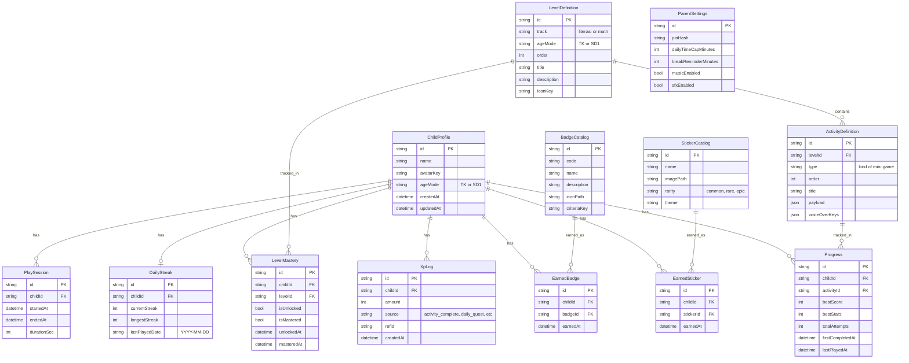

# Database Schema — Game Edukatif Anak

Skema Prisma + SQLite untuk MVP. Mendukung profil anak lokal (multi-profil per device), parent settings via PIN, definisi konten level (seed-based), serta tracking progres, XP, sticker, badge, streak, dan sesi bermain (untuk wellness).

---

## 1. ERD (Entity Relationship Diagram)



---

## 2. Skema Prisma Lengkap

File: `prisma/schema.prisma`

```prisma
generator client {
  provider = "prisma-client-js"
}

datasource db {
  provider = "sqlite"
  url      = env("DATABASE_URL")
}

// ============================================================
// PARENT (singleton: hanya 1 row, id = "singleton")
// ============================================================
model ParentSettings {
  id                   String   @id @default("singleton")
  pinHash              String?  // null = belum di-set (first-time)
  pinSetupQuestion     String?  // pertanyaan recovery sederhana
  pinSetupAnswerHash   String?
  dailyTimeCapMinutes  Int      @default(30)
  breakReminderMinutes Int      @default(15)
  musicEnabled         Boolean  @default(true)
  sfxEnabled           Boolean  @default(true)
  reduceMotion         Boolean  @default(false)
  createdAt            DateTime @default(now())
  updatedAt            DateTime @updatedAt
}

// ============================================================
// CHILD PROFILE
// ============================================================
model ChildProfile {
  id        String   @id @default(cuid())
  name      String   // nama panggilan, max 20 char
  avatarKey String   // referensi ke asset preset, contoh: "panda-orange"
  ageMode   AgeMode
  createdAt DateTime @default(now())
  updatedAt DateTime @updatedAt

  progress       Progress[]
  xpLogs         XpLog[]
  earnedStickers EarnedSticker[]
  earnedBadges   EarnedBadge[]
  levelMastery   LevelMastery[]
  dailyStreak    DailyStreak?
  playSessions   PlaySession[]

  @@index([createdAt])
}

enum AgeMode {
  TK
  SD1
}

// ============================================================
// CONTENT DEFINITIONS (seeded)
// ============================================================
model LevelDefinition {
  id          String   @id // contoh: "tk-literasi-1"
  track       Track
  ageMode     AgeMode
  order       Int      // urutan dalam track+ageMode (1, 2, 3, ...)
  title       String   // contoh: "Mengenal Huruf A-E"
  description String
  iconKey     String   // referensi asset, contoh: "huruf-block"

  activities    ActivityDefinition[]
  levelMastery  LevelMastery[]

  @@unique([track, ageMode, order])
  @@index([track, ageMode])
}

enum Track {
  literasi
  math
}

model ActivityDefinition {
  id            String   @id // contoh: "tk-literasi-1-act1"
  levelId       String
  level         LevelDefinition @relation(fields: [levelId], references: [id], onDelete: Cascade)
  type          ActivityType
  order         Int      // urutan dalam level (1, 2)
  title         String
  payload       String   // JSON serialized: konten soal, pilihan, gambar, dll.
  voiceOverKeys String   // JSON serialized: { instruksi: "vo/id/...", correct: [...], wrong: [...] }
  estimatedSec  Int      @default(180)

  progress Progress[]

  @@unique([levelId, order])
  @@index([levelId])
}

enum ActivityType {
  HURUF_GAMBAR_MATCHING
  SUSUN_SUKU_KATA
  BACA_KALIMAT_PENDEK
  HITUNG_BENDA
  BANDINGKAN_LEBIH_KURANG
  PENJUMLAHAN_VISUAL
  PENGURANGAN_VISUAL
}

// ============================================================
// PROGRESS & MASTERY
// ============================================================
model Progress {
  id               String   @id @default(cuid())
  childId          String
  child            ChildProfile @relation(fields: [childId], references: [id], onDelete: Cascade)
  activityId       String
  activity         ActivityDefinition @relation(fields: [activityId], references: [id], onDelete: Cascade)
  bestScore        Int      @default(0)
  bestStars        Int      @default(0) // 0..3
  totalAttempts    Int      @default(0)
  firstCompletedAt DateTime?
  lastPlayedAt     DateTime @default(now())

  @@unique([childId, activityId])
  @@index([childId])
  @@index([activityId])
}

model LevelMastery {
  id          String   @id @default(cuid())
  childId     String
  child       ChildProfile @relation(fields: [childId], references: [id], onDelete: Cascade)
  levelId     String
  level       LevelDefinition @relation(fields: [levelId], references: [id], onDelete: Cascade)
  isUnlocked  Boolean  @default(false)
  isMastered  Boolean  @default(false)
  unlockedAt  DateTime?
  masteredAt  DateTime?

  @@unique([childId, levelId])
  @@index([childId])
}

// ============================================================
// XP / REWARDS
// ============================================================
model XpLog {
  id        String   @id @default(cuid())
  childId   String
  child     ChildProfile @relation(fields: [childId], references: [id], onDelete: Cascade)
  amount    Int
  source    XpSource
  refId     String?  // contoh: activityId atau levelId yang trigger
  createdAt DateTime @default(now())

  @@index([childId, createdAt])
}

enum XpSource {
  ACTIVITY_COMPLETE
  STAR_BONUS
  DAILY_STREAK
  DAILY_QUEST
  LEVEL_UP
  REPLAY
}

model StickerCatalog {
  id        String  @id // contoh: "sticker-panda-bahagia"
  name      String
  imagePath String  // path URL publik, mis. /img/stickers/… (file di apps/web/public/img/stickers/)
  rarity    Rarity
  theme     String  // contoh: "hewan", "buah", "kendaraan"

  earnedBy EarnedSticker[]
}

enum Rarity {
  COMMON
  RARE
  EPIC
}

model EarnedSticker {
  id        String   @id @default(cuid())
  childId   String
  child     ChildProfile @relation(fields: [childId], references: [id], onDelete: Cascade)
  stickerId String
  sticker   StickerCatalog @relation(fields: [stickerId], references: [id])
  earnedAt  DateTime @default(now())

  @@unique([childId, stickerId])
  @@index([childId])
}

model BadgeCatalog {
  id          String  @id // contoh: "badge-streak-7"
  code        String  @unique
  name        String
  description String
  iconPath    String
  criteriaKey String  // referensi ke fungsi evaluator, contoh: "streak_days_7"

  earnedBy EarnedBadge[]
}

model EarnedBadge {
  id       String   @id @default(cuid())
  childId  String
  child    ChildProfile @relation(fields: [childId], references: [id], onDelete: Cascade)
  badgeId  String
  badge    BadgeCatalog @relation(fields: [badgeId], references: [id])
  earnedAt DateTime @default(now())

  @@unique([childId, badgeId])
  @@index([childId])
}

// ============================================================
// STREAK & SESSION (wellness)
// ============================================================
model DailyStreak {
  id              String   @id @default(cuid())
  childId         String   @unique
  child           ChildProfile @relation(fields: [childId], references: [id], onDelete: Cascade)
  currentStreak   Int      @default(0)
  longestStreak   Int      @default(0)
  lastPlayedDate  String?  // format "YYYY-MM-DD" lokal
  updatedAt       DateTime @updatedAt
}

model PlaySession {
  id          String   @id @default(cuid())
  childId     String
  child       ChildProfile @relation(fields: [childId], references: [id], onDelete: Cascade)
  startedAt   DateTime @default(now())
  endedAt     DateTime?
  durationSec Int      @default(0)
  // Untuk daily time cap: agregat per hari
  dateKey     String   // "YYYY-MM-DD"

  @@index([childId, dateKey])
}
```

---

## 3. Catatan Desain

### 3.1 SQLite-specific

- **JSON disimpan sebagai `String`**: SQLite tidak punya tipe JSON native (Prisma SQLite belum support `Json`). `payload` dan `voiceOverKeys` di-serialize ke string, di-parse di application layer dengan Zod.
- **Enum di SQLite**: Prisma generate sebagai `TEXT` dengan check constraint. Bekerja normal.
- **`@default(cuid())`**: aman untuk SQLite, generate string ID 25 karakter.

### 3.2 Mengapa `LevelMastery` Terpisah dari `Progress`?

- `Progress` granular per aktivitas; `LevelMastery` agregat per level.
- Memisahkan menyederhanakan query "level mana yang unlocked" dan menyimpan timestamp `unlockedAt`/`masteredAt` untuk audit & badge.
- Trade-off: redundansi data (bisa direkonstruksi dari `Progress`), tapi worth it untuk read performance & simplicity.

### 3.3 Mengapa `Progress` Hanya Simpan Best, Bukan History?

- Untuk MVP, kita tidak butuh analytics historikal per attempt.
- `totalAttempts` cukup untuk metric "berapa kali anak ulang aktivitas ini".
- Jika butuh history detail, bisa tambah model `ActivityAttempt` di Phase 2.

### 3.4 Mengapa `XpLog` Disimpan Detail?

- Untuk parent dashboard "anak hari ini dapat berapa XP" → query `WHERE childId = ? AND createdAt >= today`.
- Anti-cheat sederhana: bisa audit kalau ada anomali (XP spike).
- Storage cost minimal (integer + string).

### 3.5 Singleton `ParentSettings`

- Hanya 1 row dengan `id = "singleton"`. Parent settings device-wide, bukan per anak.
- Setiap anak share parent yang sama (asumsi: 1 device = 1 keluarga).

### 3.6 `DailyStreak` Optional per Profil

- Relasi `ChildProfile.dailyStreak: DailyStreak?` (1-to-0..1).
- Row di-create lazy saat anak menyelesaikan aktivitas pertama.

### 3.7 `PlaySession` Untuk Wellness

- Setiap kali anak buka aplikasi → create `PlaySession` baru dengan `startedAt`.
- Setiap N detik (atau saat tab close): update `endedAt` & `durationSec`.
- Daily time cap: `SUM(durationSec) WHERE childId = ? AND dateKey = today`.

---

## 4. Indexing Strategy

| Index                                  | Alasan                                                          |
| -------------------------------------- | --------------------------------------------------------------- |
| `Progress (childId, activityId)` UNIQUE | Cegah duplikat progres per aktivitas                            |
| `Progress (childId)`                   | Query "semua progres anak ini"                                  |
| `LevelMastery (childId, levelId)` UNIQUE | Cegah duplikat                                                |
| `LevelDefinition (track, ageMode, order)` UNIQUE | Cegah duplikat seed                                  |
| `XpLog (childId, createdAt)`           | Query XP harian/mingguan                                        |
| `PlaySession (childId, dateKey)`       | Query waktu bermain hari ini                                    |
| `EarnedSticker (childId, stickerId)` UNIQUE | Cegah dapat sticker yang sama dua kali                     |

---

## 5. Migration & Seed Strategy

### 5.1 Migration

```sh
pnpm prisma migrate dev --name init
```

### 5.2 Seed

`prisma/seed.ts` (entry) berisi:

1. **`ParentSettings`** singleton dengan default values, `pinHash = null` (belum diset, akan di-set saat onboarding).
2. **`StickerCatalog`** ~30 sticker (10 common, 10 rare, 10 epic) dengan tema bervariasi.
3. **`BadgeCatalog`** 7 badge MVP (lihat PRD bagian 7.4).
4. **`LevelDefinition` + `ActivityDefinition`** untuk 12 level MVP (3 level × 2 jalur × 2 mode), masing-masing 1–2 aktivitas (~18 aktivitas total). Detail konten ada di [content-design.md](content-design.md).

Seed dijalankan otomatis saat `pnpm prisma migrate reset` atau manual via `pnpm prisma db seed`.

### 5.3 Idempotency

Semua seed pakai `upsert` agar bisa dijalankan berulang tanpa duplikat:

```ts
await prisma.stickerCatalog.upsert({
  where: { id: 'sticker-panda-bahagia' },
  update: { name: 'Panda Bahagia', imagePath: '...' },
  create: { id: 'sticker-panda-bahagia', name: 'Panda Bahagia', ... },
});
```

---

## 6. Contoh Query (Common Operations)

### 6.1 Dashboard Anak

```ts
const dashboard = await prisma.childProfile.findUnique({
  where: { id: childId },
  include: {
    levelMastery: { include: { level: true }, orderBy: { level: { order: 'asc' } } },
    dailyStreak: true,
    earnedBadges: { include: { badge: true }, take: 5, orderBy: { earnedAt: 'desc' } },
    earnedStickers: { include: { sticker: true }, take: 3, orderBy: { earnedAt: 'desc' } },
  },
});

const totalXp = await prisma.xpLog.aggregate({
  where: { childId },
  _sum: { amount: true },
});
```

### 6.2 Submit Aktivitas (Transaction)

```ts
await prisma.$transaction(async (tx) => {
  // 1. Update / upsert Progress
  const progress = await tx.progress.upsert({
    where: { childId_activityId: { childId, activityId } },
    update: {
      bestStars: { set: Math.max(prevStars, stars) },
      totalAttempts: { increment: 1 },
      lastPlayedAt: new Date(),
    },
    create: {
      childId, activityId,
      bestScore: score, bestStars: stars,
      totalAttempts: 1,
      firstCompletedAt: new Date(),
      lastPlayedAt: new Date(),
    },
  });

  // 2. Tambah XP
  await tx.xpLog.create({
    data: { childId, amount: xpEarned, source: 'ACTIVITY_COMPLETE', refId: activityId },
  });

  // 3. Cek mastery level
  // ... (logika di mastery-engine)

  // 4. Cek stiker baru
  // ... (logika di reward-engine)
});
```

### 6.3 Time Cap Hari Ini

```ts
const today = new Date().toISOString().slice(0, 10);
const totalToday = await prisma.playSession.aggregate({
  where: { childId, dateKey: today },
  _sum: { durationSec: true },
});
const minutesPlayed = Math.floor((totalToday._sum.durationSec ?? 0) / 60);
```

---

## 7. Future Schema Considerations (Post-MVP)

- **`ParentAccount`** dengan email/password jika butuh multi-device sync.
- **`ActivityAttempt`** untuk history detail per attempt (analytics belajar).
- **`DailyQuest`** materialized untuk daily quest yang di-generate (sekarang dihitung on-the-fly).
- **`Notification`** jika menambah notif (in-app, bukan push).
- **Soft delete** dengan kolom `deletedAt` jika butuh undo profil delete.
