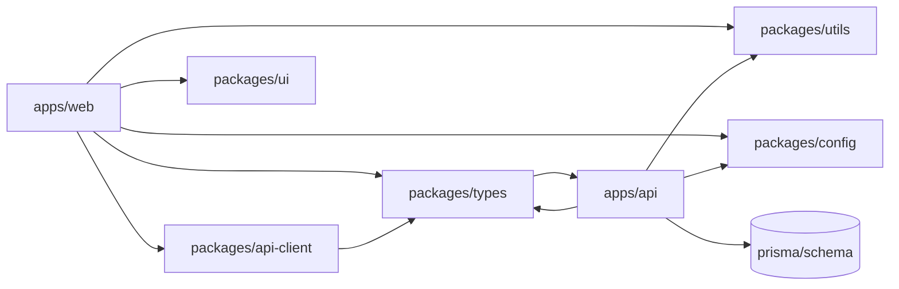

# Rekomendasi Fitur & Perbaikan Performa

> Lampiran terhadap [PRD-implementation-status.md](PRD-implementation-status.md) dan
> [roadmap.md](roadmap.md). Disusun berbasis pemeriksaan kode aktual di `apps/web/src/` dan
> `apps/api/src/` per Mei 2026.
>
> **Tingkat prioritas**:
>
> - **P0** — sebulan ini (perbaikan stabilitas & performa yang sudah teramati,
>   fondasi yang menahan pekerjaan lain).
> - **P1** — kuartal ini (fitur dengan dampak produk jelas, gap PRD G2–G4).
> - **P2** — kuartal berikutnya (post-MVP / pengembangan jangka panjang).

---

## 1. Ringkasan

| Kategori                        | P0  | P1  | P2  | Total |
| ------------------------------- | --- | --- | --- | ----- |
| Performa                        | 5   | 1   | 0   | 6     |
| Keamanan & reliability          | 4   | 1   | 1   | 6     |
| Fitur anak                      | 0   | 4   | 1   | 5     |
| Fitur orang tua                 | 0   | 3   | 1   | 4     |
| Fitur admin                     | 0   | 5   | 0   | 5     |
| PWA & aksesibilitas             | 1   | 3   | 0   | 4     |
| Konten                          | 0   | 3   | 1   | 4     |
| DX & testing                    | 2   | 2   | 0   | 4     |
| Arsitektur (monorepo)           | 0   | 0   | 1   | 1     |
| **Total**                       | 12  | 22  | 5   | 39    |

Catatan: P0 berfokus pada hal yang sudah berdampak ke pengguna sekarang
(lonjakan latency saat banyak level/profile, sesi orang tua hilang setelah
restart Fly, bundle awal besar). Sisanya merapikan PRD G2–G4 dan post-MVP.

---

## 2. Performa

### 2.1 (P0) Hilangkan N+1 di `GET /api/profiles/:id/levels`

[apps/api/src/routes/web/gameplay.ts](../apps/api/src/routes/web/gameplay.ts) baris 97–149
melakukan loop level dan untuk **setiap** level memanggil tiga query Prisma
(`levelMastery.findUnique`, `activityDefinition.findMany`, `progress.findMany`).
Saat 12 level (3×2×2) dan satu profil aktif, ini sudah 36 round-trip ke DB.
Ganti dengan satu kueri:

```ts
const levels = await prisma.levelDefinition.findMany({
  where: { ageMode: child.ageMode, ...(trackQ ? { track: trackQ } : {}) },
  include: {
    activities: { select: { id: true } },
    levelMastery: { where: { childId } },
  },
});
const progress = await prisma.progress.findMany({
  where: { childId, activity: { level: { ageMode: child.ageMode } } },
  select: { activityId: true, bestStars: true },
});
```

Lalu hitung `starsEarned`, `progressPct`, dsb. di memori — total dua query untuk
seluruh response.

### 2.2 (P0) Sama untuk `GET /api/parent/report/:childId` dan dashboard anak

[apps/api/src/routes/web/parent-area.ts](../apps/api/src/routes/web/parent-area.ts) loop
`tracks` dan untuk tiap track memanggil `count`, `findMany`, `progress.count`.
Dapat diringkas memakai `groupBy` + satu `findMany` aktivitas.
[apps/api/src/services/dashboard.ts](../apps/api/src/services/dashboard.ts) juga
memanggil beberapa query terpisah; cek peluang `Promise.all` atau gabungan.

### 2.3 (P0) Bungkus `submitActivity` dengan `prisma.$transaction`

[apps/api/src/services/submit-activity.ts](../apps/api/src/services/submit-activity.ts)
melakukan banyak `update`/`create` (progress, xpLog, streak, mastery, badge,
sticker) tanpa transaksi. Jika gagal di tengah, state anak bisa parsial
(mis. XP bertambah tapi mastery tidak tersinkron). Bungkus ke dalam interactive
transaction Prisma (`$transaction(async (tx) => { … })`) supaya atomic.

### 2.4 (P0) Code-splitting frontend

[apps/web/src/router.tsx](../apps/web/src/router.tsx) berukuran **1235 LoC** dan mengimpor seluruh
halaman admin (`AdminAnalyticsPage`, `AdminContentPage`,
`AdminBankEditorPage`, …) dan [ActivityPlayer](../apps/web/src/features/ActivityPlayer.tsx)
(771 LoC) dalam satu bundle utama. Anak yang tidak pernah membuka `/admin` ikut
mengunduh ratusan KB JS. Pisahkan dengan `lazy()` TanStack Router atau
`React.lazy` + `Suspense`:

```ts
const AdminContentPage = lazy(() =>
  import('@/features/admin/AdminContentPage').then((m) => ({
    default: m.AdminContentPage,
  })),
);
```

Lakukan minimal untuk:

- Semua `Admin*Page` di [apps/web/src/features/admin/](../apps/web/src/features/admin/).
- `ActivityPlayer` (hanya dipakai di rute `/p/:childId/play/:activityId`).
- `OnboardingFlowPage` (hanya saat first-run per profil).

### 2.5 (P0) Tambah React Query / SWR untuk cache GET

Saat ini setiap halaman fetch ulang lewat `useEffect` tanpa cache (lihat
[apps/web/src/features/home/HomeLanding.tsx](../apps/web/src/features/home/HomeLanding.tsx),
`DashboardPage`, `AdminChildrenPage`, dst.). Tambah
`@tanstack/react-query` + `QueryClientProvider` di [apps/web/src/main.tsx](../apps/web/src/main.tsx),
lalu bungkus pemanggilan `api.getProfiles`, `api.getDashboard`,
`api.getLevels`, `api.getStickers` dengan `useQuery`. Manfaat:

- Stale-while-revalidate → klik balik tidak membuat layar berkedip.
- Invalidasi saat mutasi (mis. setelah `patchProfileSelf`).
- Built-in retry & dedup request paralel.

### 2.6 (P1) Indeks Prisma untuk kolom yang sering difilter

Cek [prisma/schema.prisma](../prisma/schema.prisma) dan tambahkan `@@index` jika
belum ada untuk:

- `Progress(childId, activityId)` (sudah lewat unique?).
- `XpLog(childId, createdAt)` untuk agregasi.
- `LevelMastery(childId, levelId)`.

Verifikasi dengan `EXPLAIN ANALYZE` di Postgres (Prisma Console).

---

## 3. Keamanan & reliability

### 3.1 (P0) Lindungi `PATCH /api/profiles/:id/self`

[apps/api/src/routes/web/profiles-crud.ts](../apps/api/src/routes/web/profiles-crud.ts)
mengekspos endpoint ubah profil tanpa autentikasi (untuk UX pemilih pemain di
beranda). Risiko: siapa pun yang mendapatkan id UUID dapat mengganti nama,
avatar, atau mode. Pilihan mitigasi (kombinasikan):

- Wajibkan PIN orang tua jika sudah diset (cek `parentSettings.pinHash`).
  Jika belum diset, izinkan (perangkat baru).
- Tambah rate-limit per IP (lihat §3.3).
- Audit log ringan ke `AuditLog` dengan `actorType = 'device'`.

### 3.2 (P0) Pindahkan parent session ke Prisma

[apps/api/src/parent-session.ts](../apps/api/src/parent-session.ts) menyimpan token di
`Map` in-memory dengan TTL 30 menit. Setiap restart Fly atau scale-out membuat
sesi orang tua hilang dan harus PIN ulang. Pindahkan ke model Prisma:

```prisma
model ParentSession {
  token     String   @id
  createdAt DateTime @default(now())
  expiresAt DateTime
  @@index([expiresAt])
}
```

Ganti `Map` dengan query `findUnique` + cleanup berkala (cron / job ringan saat
verify). Token tetap dikirim via header `X-Parent-Session`.

### 3.3 (P0) Rate limit endpoint sensitif

Belum ada middleware rate-limit di backend. Pasang
[`hono-rate-limiter`](https://hono.dev/middleware/builtin/rate-limit) atau
implementasi Redis-less berbasis Map+TTL untuk:

- `/api/auth/*` (sudah ada rate-limit Better Auth tapi mengembalikan 429
  tanpa context lokal).
- `POST /api/parent/verify-pin` & `setup-pin` & `change-pin`.
- `PATCH /api/profiles/:id/self` (lihat §3.1).

### 3.4 (P0) `app.onError` global

[apps/api/src/app.ts](../apps/api/src/app.ts) belum punya `app.onError`. Beberapa rute
admin memakai `schema.parse()` (Zod) yang dapat throw → respons 500 telanjang
tanpa pesan JSON. Tambahkan handler:

```ts
api.onError((err, c) => {
  if (err instanceof ZodError) {
    return c.json({ error: { code: 'VALIDATION_ERROR', message: err.message } }, 400);
  }
  console.error('[api] unhandled', err);
  return c.json({ error: { code: 'INTERNAL', message: 'Terjadi kesalahan' } }, 500);
});
```

### 3.5 (P1) Konsolidasi role-check admin

Plugin Better Auth di [apps/api/src/auth.ts](../apps/api/src/auth.ts) punya matriks
`hasPermission`, tapi `/api/admin/*` memakai
[apps/api/src/admin-middleware.ts](../apps/api/src/admin-middleware.ts) sendiri. Sumber
kebenaran ganda. Pilih satu (disarankan plugin matrix) dan gunakan helper
tipis di middleware.

### 3.6 (P2) Audit log retensi & rotasi

`AuditLog` tumbuh tanpa retensi. Tambahkan job pembersihan (mis. retain
12 bulan) dan ekspor sebelum hapus.

---

## 4. Fitur anak

### 4.1 (P1) Adaptive difficulty

[PRD §6.2](roadmap.md) (Phase 4b) menyebut adaptive difficulty. Sederhana
untuk MVP+1: pakai rata-rata bintang **5 sesi terakhir** per anak per track
(dari [apps/api/src/services/submit-activity.ts](../apps/api/src/services/submit-activity.ts))
untuk menyesuaikan ukuran sampel bank di
[packages/utils/src/math-session.ts](../packages/utils/src/math-session.ts) (mis. 5–8 soal jadi
6–10 saat anak mahir).

### 4.2 (P1) Quest mingguan + papan tantangan

Saat ini hanya ada quest harian (lihat
[apps/api/src/services/daily-quest.ts](../apps/api/src/services/daily-quest.ts)). Tambah
quest mingguan (mis. "selesaikan 10 aktivitas" → bonus stiker langka) untuk
retensi D7 yang menjadi metrik MVP.

### 4.3 (P1) Mascot Lottie

Rute roadmap §5.1 dan §7.3 (cut line) menempatkan mascot Lottie sebagai
optional. Geser ke P1 karena ini menjadi sentuhan UX terkuat untuk audiens
anak. Komponen baru `<MascotLottie state="idle | celebrate | sleep" />`
dipakai di dashboard anak dan layar hasil di
[apps/web/src/features/ActivityPlayer.tsx](../apps/web/src/features/ActivityPlayer.tsx).

### 4.4 (P1) Ekspor album stiker (PNG / cetak)

[apps/web/src/features/child/StickerAlbumPage.tsx](../apps/web/src/features/child/StickerAlbumPage.tsx)
sudah menampilkan koleksi. Tambahkan tombol "Cetak album" untuk orang tua →
render `html2canvas` ke PNG/PDF. Bagus untuk reward fisik.

### 4.5 (P2) Tema mingguan & stiker spesial

[PRD §6.5](roadmap.md) Phase 4e — tema (Tata Surya, Kebun Binatang).
Memerlukan kerja konten besar; biarkan di P2.

---

## 5. Fitur orang tua

### 5.1 (P1) Insight area lemah/kuat di `/parent`

Saat ini laporan `/parent` hanya menampilkan total XP dan jumlah aktivitas
(lihat blok report di [apps/web/src/router.tsx](../apps/web/src/router.tsx) `ParentPage`).
Tambahkan diff `perTrack` (literasi vs math) plus rekomendasi 2–3 aktivitas
untuk dimainkan ulang berbasis bintang terendah. API sudah mengirim `perTrack`
di [apps/api/src/routes/web/parent-area.ts](../apps/api/src/routes/web/parent-area.ts).

### 5.2 (P1) Email weekly progress (opt-in)

PRD §6.6. Memerlukan `email` opsional di `ParentSettings`, kirim laporan via
provider (Resend/Postmark). Cron mingguan di Fly Machines.

### 5.3 (P1) PIN recovery dari pertanyaan pemulihan

Schema sudah menyimpan `pinSetupQuestion` & `pinSetupAnswerHash`
([apps/api/src/routes/web/parent-area.ts](../apps/api/src/routes/web/parent-area.ts)).
Belum ada endpoint `forgot-pin` yang memakai jawaban pemulihan untuk reset
PIN. Tambahkan flow `verify-recovery` → `change-pin` tanpa PIN lama.

### 5.4 (P2) Multi-device sync via QR pair

PRD §6.3. Memerlukan akun cloud orang tua dan migrasi `ChildProfile` ke
multi-tenant.

---

## 6. Fitur admin

### 6.1 (P1) Preview payload "kartu per item" di Bank Editor

PRD-feature-admin-panel.md G2 menyebut preview ini, dan
[PRD-implementation-status.md](PRD-implementation-status.md) menandai belum.
Render setiap item bank sebagai kartu mini dengan tampilan menyerupai mini-game
target di [apps/web/src/features/admin/AdminBankEditorPage.tsx](../apps/web/src/features/admin/AdminBankEditorPage.tsx).

### 6.2 (P1) Grafik retensi D1/D7 di `/admin/analytics`

PRD G3 §10 menyebut grafik batang. Saat ini
[apps/web/src/features/admin/AdminAnalyticsPage.tsx](../apps/web/src/features/admin/AdminAnalyticsPage.tsx)
hanya menampilkan angka. Tambah komponen chart ringan (Recharts atau
[Chart.js](https://www.chartjs.org)) untuk D1/D7, level completion, rata bintang
per aktivitas.

### 6.3 (P1) Ekspor CSV daftar anak & audit log

Sudah ada UI tapi belum tersedia ekspor CSV (PRD G4). Tambah endpoint
`GET /api/admin/export/children.csv` dan `GET /api/admin/export/audit.csv`
di [apps/api/src/admin.ts](../apps/api/src/admin.ts) yang stream `text/csv` (Hono
mendukung `c.body(stream)`).

### 6.4 (P1) 2FA TOTP untuk `super_admin`

Better Auth menyediakan plugin 2FA. Aktifkan untuk akun dengan role
`super_admin`. Konfigurasikan di [apps/api/src/auth.ts](../apps/api/src/auth.ts).

### 6.5 (P1) Halaman Activity preview (read-only)

QA konten saat ini tidak bisa memainkan aktivitas tanpa membuat profil anak.
Tambah rute `/admin/activities/:id/preview` yang render
[apps/web/src/features/ActivityPlayer.tsx](../apps/web/src/features/ActivityPlayer.tsx) dengan
mode "preview" (skor tidak dikirim, tidak menulis ke DB).

---

## 7. PWA & aksesibilitas

### 7.1 (P0) Install prompt + banner update SW

[apps/web/vite.config.ts](../apps/web/vite.config.ts) sudah memakai `vite-plugin-pwa` dengan
`registerType: 'autoUpdate'`, dan [apps/web/src/main.tsx](../apps/web/src/main.tsx) memanggil
`registerSW`. Belum ada UI yang memunculkan **install prompt**
(`beforeinstallprompt`) atau **banner pemberitahuan update SW**. Tambah
komponen `<InstallPrompt />` dan `<UpdatePrompt />` (workbox-window sudah
ada di dependencies).

### 7.2 (P1) Offline fallback halaman anak

Konfigurasi PWA saat ini `NetworkOnly` untuk `/api/*`. Tambahkan
`StaleWhileRevalidate` khusus untuk `GET /api/profiles/:id/dashboard` &
`GET /api/profiles/:id/stickers` agar anak tetap melihat data terakhir saat
offline. Update [apps/web/vite.config.ts](../apps/web/vite.config.ts) `runtimeCaching`.

### 7.3 (P1) Audit Lighthouse + a11y

Roadmap §5.3 menargetkan Performance ≥85, Accessibility ≥95, PWA ≥90.
Belum ada laporan Lighthouse di repo. Jalankan dan dokumentasikan baseline
+ daftar action item (kontras tombol, label form, focus-visible). Banyak
komponen sudah `aria-pressed` & `aria-label`, tapi modal di
[apps/web/src/features/home/HomeLanding.tsx](../apps/web/src/features/home/HomeLanding.tsx)
masih perlu focus trap.

### 7.4 (P1) Persist preferensi `prefers-reduced-motion`

Toggle "Kurangi animasi" di `/parent` sudah ada, tapi sinkronisasi ke
[packages/utils/src/game-feedback-sync.ts](../packages/utils/src/game-feedback-sync.ts) bergantung
pada `localStorage` per perangkat. Pastikan saat orang tua menyimpan
pengaturan, nilai langsung diaplikasikan ke
`useGameFeedback` tanpa reload.

---

## 8. Konten

### 8.1 (P1) Voice-over MP3 produksi

[PRD-feature-feedback-confetti-math-bank.md](PRD-feature-feedback-confetti-math-bank.md)
§7 menyebut `wrong-soft.mp3`. Saat ini SFX salah memakai Web Audio prosedural
([apps/web/src/hooks/useGameFeedback.ts](../apps/web/src/hooks/useGameFeedback.ts)). Lengkapi VO
instruksi dan completion line per aktivitas, taruh di **`apps/web/public/audio/`**.

### 8.2 (P1) Validator seed otomatis

`prisma/math-banks.ts` & `prisma/literasi-banks.ts` punya banyak entri tapi
belum ada test/script yang menjamin minimal jumlah & format. Tambahkan:

- Script `scripts/bank-validate.ts` yang memvalidasi schema setiap bank.
- npm script `bank:validate` yang dipanggil di CI.

### 8.3 (P1) Level 4–7 untuk semua jalur

[docs/PRD-recommended-backlog-levels-4-10.md](PRD-recommended-backlog-levels-4-10.md)
sudah memetakan. Eksekusi konten level 4–7 (estimasi: ~1 minggu konten + 1
hari seed update).

### 8.4 (P2) Konten bilingual (Inggris)

PRD §6.4 Phase 4d. Memerlukan i18n setup (React-i18next) + VO Inggris.

---

## 9. DX & testing

### 9.1 (P0) Husky + lint-staged

Roadmap §2.1 task #7 mencatat Husky pre-commit, tapi
[package.json](../package.json) belum punya. Tambah `husky` + `lint-staged`
dengan hook `pre-commit` menjalankan `pnpm check` pada file ter-stage.

### 9.2 (P0) Test backend `apps/api/src/services/*`

Sudah ada `*.test.ts` ringkas di `apps/api/src/services/` (Vitest, happy-dom/node).
Tingkatkan cakupan untuk modul inti:
[apps/api/src/services/submit-activity.ts](../apps/api/src/services/submit-activity.ts),
[apps/api/src/services/mastery.ts](../apps/api/src/services/mastery.ts), dan
[apps/api/src/services/daily-quest.ts](../apps/api/src/services/daily-quest.ts).
Pertimbangkan Prisma test database (Postgres docker) untuk integrasi.

### 9.3 (P1) E2E Playwright "happy path"

Saat ini hanya ada [e2e/home.spec.ts](../e2e/home.spec.ts) yang memeriksa
header. Tambah skenario:

- Buat profil → main 1 aktivitas → dapat bintang.
- Setup PIN orang tua → ubah PIN → verify PIN.
- Login admin → buka analytics.

### 9.4 (P1) Sentry / log shipping di Fly

Saat ini error backend hanya `console.error` ke stdout. Tambah Sentry SDK
(atau axiom/Better Stack) di [apps/api/src/index.ts](../apps/api/src/index.ts) untuk
trace error production tanpa scroll `fly logs`.

---

## 10. Saran roadmap 4 minggu

| Minggu | Fokus utama                                | Item            |
| ------ | ------------------------------------------ | --------------- |
| 1      | Stabilitas DB & query                      | §2.1, §2.2, §2.3, §3.4 |
| 2      | Bundle & cache frontend                    | §2.4, §2.5, §7.1 |
| 3      | Sesi orang tua tahan banting + rate limit  | §3.1, §3.2, §3.3, §9.2 |
| 4      | Konsolidasi UX admin + DX                  | §6.1, §6.2, §9.1, §9.3 |

Hasil akhir 4 minggu: latency `/api/profiles/:id/levels` turun signifikan,
TTI Netlify lebih cepat (admin tidak ikut bundle utama), sesi orang tua tidak
hilang setelah deploy Fly, panel admin punya preview konten + chart retensi,
dan pre-commit + e2e mencegah regresi rilis berikutnya.

---

## 11. Referensi cepat

| Path                                                                                       | Alasan disebut                                            |
| ------------------------------------------------------------------------------------------ | --------------------------------------------------------- |
| [apps/api/src/routes/web/gameplay.ts](../apps/api/src/routes/web/gameplay.ts)                           | N+1 utama di endpoint `levels`, hotspot performa.         |
| [apps/api/src/routes/web/parent-area.ts](../apps/api/src/routes/web/parent-area.ts)                    | Loop `tracks` dengan banyak round-trip; PIN flow.         |
| [apps/api/src/services/submit-activity.ts](../apps/api/src/services/submit-activity.ts)                | Banyak mutasi tanpa transaksi; titik test prioritas.      |
| [apps/api/src/services/admin-analytics.ts](../apps/api/src/services/admin-analytics.ts)                | `progress.findMany` tanpa filter; cache TTL 5 menit.      |
| [apps/api/src/parent-session.ts](../apps/api/src/parent-session.ts)                                    | `Map` in-memory; perlu pindah ke Prisma.                  |
| [apps/api/src/admin.ts](../apps/api/src/admin.ts)                                                      | Sumber matriks role admin; titik untuk ekspor CSV.        |
| [apps/api/src/routes/web/profiles-crud.ts](../apps/api/src/routes/web/profiles-crud.ts)                | `PATCH /:id/self` tanpa auth.                             |
| [apps/api/src/app.ts](../apps/api/src/app.ts)                                                          | Tempat menambah `app.onError` & rate-limit middleware.    |
| [apps/web/src/router.tsx](../apps/web/src/router.tsx)                                                        | 1235 LoC, kandidat utama code-splitting.                  |
| [apps/web/src/features/ActivityPlayer.tsx](../apps/web/src/features/ActivityPlayer.tsx)                      | 771 LoC, hanya dibutuhkan saat anak bermain.              |
| [apps/web/src/features/admin/](../apps/web/src/features/admin/)                                              | Semua halaman admin, dapat di-`lazy` di router.           |
| [apps/web/src/features/home/HomeLanding.tsx](../apps/web/src/features/home/HomeLanding.tsx)                  | Modal edit profil, butuh focus trap.                      |
| [packages/utils/src/game-feedback-sync.ts](../packages/utils/src/game-feedback-sync.ts)                          | Persist preferensi perangkat (`@mainceria/utils`), dipakai `useGameFeedback`. |
| [apps/web/vite.config.ts](../apps/web/vite.config.ts)                                      | Konfigurasi PWA & runtime caching.                        |
| [package.json](../package.json)                                                            | Tempat menambah Husky, lint-staged, react-query.          |
| [pnpm-workspace.yaml](../pnpm-workspace.yaml)                                              | Sudah aktif (`apps/*`, `packages/*`); lanjutkan migrasi kompatibel per batch. |

---

## 12. Transformasi ke pnpm monorepo (P2)

Repo sudah memasuki fase transisi monorepo pnpm: workspace aktif, `apps/api`
dan `apps/web` sudah tersedia, serta `packages/*` dipertahankan sebagai shared
layer. Fokus fase ini adalah merapikan perpindahan modul secara bertahap
(compatibility-first), menjaga deploy Netlify/Fly tetap stabil, dan memastikan
admin tetap berada di `apps/web` (lazy route) tanpa membuat app admin terpisah.

### 12.1 Tujuan & manfaat

- **Pemisahan boundary app** — API dan web dipisah sebagai deployable utama;
  bundle admin tetap di `apps/web` tetapi dipisah via lazy route agar tidak
  masuk critical path user anak/orang tua.
- **Sharing tipe** — definisi Hono RPC bisa di-import lintas layer di
  `apps/web` dan `apps/api` via `packages/types` tanpa duplikasi.
- **SSR landing (opsional / roadmap)** — TanStack Start atau SSR terpisah bisa
  memperpendek TTFB landing untuk SEO; **implementasi saat ini**: Vite + SPA +
  TanStack Router (sesuai [README](../README.md)); migrasi SSR adalah langkah
  terpisah setelah monorepo stabil.
- **Konfig terpusat** — preset Biome, `tsconfig.base.json`, dan Tailwind
  preset bisa di-centralize di `packages/config` untuk dipakai semua app
  secara bertahap.

### 12.2 Struktur target

Hanya dua app deployable utama di `apps/*`; schema & tooling global tetap di
root repo.

```
.
├── apps/
│   ├── api/                    # paket `@mainceria/api`
│   │   └── src/                # Hono + Prisma, entry index.ts
│   └── web/                    # paket `@mainceria/web`
│       ├── index.html          # root HTML Vite
│       ├── vite.config.ts       # root proyek Vite = folder ini
│       ├── public/             # statis → dilayani di /icons, /img, /audio …
│       └── src/                # React + TanStack Router (anak, orang tua, admin)
├── packages/
│   ├── api-client/             # `createHcApi`, `unwrapData` — **`@mainceria/api-client`**
│   ├── config/                 # tsconfig.base dan preset bersama
│   ├── ui/                     # komponen React + Tailwind (button, dialog, dll.)
│   ├── utils/                  # helper bersama (`brand`, `game-feedback-sync`, `math-session`; `@mainceria/utils`)
│   └── types/                  # Hono RPC types, kontrak konsumen frontend
├── prisma/                     # skema satu sumber untuk semua app
├── scripts/                    # dev orchestration, admin-create, dll.
├── dist/                       # keluaran `vite build` (root), Netlify publish
├── package.json               # scripts workspace (`pnpm dev`, build, check)
├── pnpm-workspace.yaml        # packages: apps/* , packages/*
└── ...
```



### 12.3 Pemetaan kode existing → folder baru

| Sumber sekarang                                                                  | Tujuan                                                                   |
| -------------------------------------------------------------------------------- | ------------------------------------------------------------------------ |
| Kode API Hono + Prisma di [apps/api/src/](../apps/api/src/)                      | Tetap di `apps/api`; deploy `@mainceria/api` (Fly/Docker), tanpa folder shim `server/` |
| [apps/web/src/router.tsx](../apps/web/src/router.tsx) rute `/`, `/p/$childId/*`, `/parent`, `/admin/*` + [apps/web/src/features/admin/](../apps/web/src/features/admin/) | `apps/web/src/routes/` (pecah router besar, opsional) |
| [packages/ui/src/Button.tsx](../packages/ui/src/Button.tsx) (komponen UI bersama, mis. `Button`) | Sudah di **`packages/ui`** / impor **`@mainceria/ui`** dari `apps/web` |
| [packages/utils/src/brand.ts](../packages/utils/src/brand.ts), [game-feedback-sync.ts](../packages/utils/src/game-feedback-sync.ts), [math-session.ts](../packages/utils/src/math-session.ts) | Sudah di `packages/utils`; diekspor sebagai **`@mainceria/utils`**. |
| [packages/api-client/src/hono-client.ts](../packages/api-client/src/hono-client.ts) | **`@mainceria/api-client`** — `createHcApi`, `unwrapData`; web mengikat `apiBaseURL` di [hono-client.ts](../apps/web/src/lib/hono-client.ts) |
| [apps/web/src/api.ts](../apps/web/src/api.ts), [api-admin.ts](../apps/web/src/api-admin.ts) | Pembungkus domain RPC (tetap di web) |
| [packages/types/src/index.ts](../packages/types/src/index.ts) | **`AppType`** + tipe schema (re-export dari `apps/api`) |
| [prisma/](../prisma/)                                                             | tetap di root, di-akses dari `apps/api` / skrip                                      |

### 12.4 Tahap migrasi (incremental, compatibility-first)

1. **Workspace foundation (selesai)** — `pnpm-workspace.yaml` mendeklarasikan
   `apps/*` + `packages/*`, script root memakai `pnpm --filter`.
2. **API di `apps/api/src`** — sumber kebenaran backend; folder `server/` di root
   telah dihapus; script & Docker hanya menyalin `apps/` + `packages/`.
3. **Shared package hardening (berjalan)** — util/type/config/ui di `packages/*`;
   import lintas area memakai nama package (`@mainceria/*`) di mana memungkinkan.
4. **`apps/web/src` (selesai)** — seluruh UI TanStack Router/React berada di app
   `@mainceria/web`; folder `src/` di root repo tidak dipakai lagi.

### 12.5 Konfigurasi penting

- `pnpm-workspace.yaml`:

  ```yaml
  packages:
    - 'apps/*'
    - 'packages/*'
  ```

- **TypeScript:** saat ini [tsconfig.json](../tsconfig.json) di root memetakan
  `@/*` → `apps/web/src/*` dan jalur `@mainceria/types` /
  `@mainceria/utils` agar IDE & `tsc --noEmit` tetap satu entry. Target
  **lanjutan (opsional)**: tiap app punya `tsconfig.json` yang
  `extends` [packages/config/tsconfig.base.json](../packages/config/tsconfig.base.json),
  ditambah alias eksplisit per app (`@web/*`, `@api/*`), dan impor bersama lewat nama paket
  `@mainceria/*` sepenuhnya.
- **Frontend Vite (@mainceria/web):**
  - Sumber bundle: **`apps/web/src/main.tsx`** (lewat **`apps/web/index.html`**).
  - Aset statis: **`apps/web/public/`** (bukan lagi `public/` di root repo).
  - Konfig: **`apps/web/vite.config.ts`**; perintah resmi menjalankan Vite dari
    **root repo** dengan `--config apps/web/vite.config.ts` (sudah ada di script
    `dev:vite` / `build` / `preview` milik paket web).
  - **`build.outDir`**: **`dist/`** pada root repo (+ `emptyOutDir`) agar
    Netlify **`publish = dist`** di [netlify.toml](../netlify.toml) tidak berubah.
- **Backend (@mainceria/api):** entry **`apps/api/src/index.ts`**; Prisma schema
  di **`prisma/schema.prisma`** (root); migrasi/deploy memanggil CLI dari root
  seperti sekarang (`release_command`, `pnpm start`, dll.).
- Build/lint monorepo tetap via pnpm (`pnpm --filter …`, atau `pnpm -r` untuk
  skenario massal); Turborepo tidak wajib.
- Better Auth: **`baseURL` / origin** browser harus selaras antara Netlify SPA
  dan API di `apps/api` (variabel seperti `BETTER_AUTH_URL` — lihat README).

### 12.6 Risiko & mitigasi

| Risiko                                                          | Mitigasi                                                                          |
| --------------------------------------------------------------- | --------------------------------------------------------------------------------- |
| Split besar frontend + admin berisiko regressi route              | Jalankan migrasi bertahap dengan snapshot route lama → baru dan smoke test `/`, `/parent`, `/admin/*`. |
| Type Hono RPC putus saat dipindah ke `packages/types`            | Buat script `pnpm --filter api build:types` yang emit `.d.ts` untuk frontend.     |
| CI/CD Fly + Netlify perlu update                                 | `pnpm install` di root, lalu `pnpm --filter api ...` / `--filter web ...`.        |
| Prisma client bertambah lambat di-bootstrap di banyak app        | Letakkan generated client di `node_modules/.prisma/client` (default), re-export via `packages/types`. |
| Migrasi pertama berisiko regresi auth                            | Pertahankan endpoint `/api/auth/*` di host yang sama; jangan ubah `BETTER_AUTH_URL` sampai migrasi route stabil. |

### 12.7 Kapan TIDAK melakukannya

- **Solo dev / 1 deployable.** Monorepo memberi value mulai 2+ kontributor
  yang menabrak file yang sama atau 2+ deployable yang ingin rilis terpisah.
- **Pondasi belum stabil.** Selesaikan §2 (performa) dan §3 (keamanan &
  reliability) lebih dulu — migrasi struktural di atas pondasi yang masih
  retak hanya menambah permukaan regresi.
- **Belum ada CI yang men-cover end-to-end.** Tanpa Playwright dasar (§9.3),
  bug saat memindah rute akan sulit terdeteksi.

### 12.8 Definition of done

- `pnpm install` sukses di root; `pnpm list -r --depth -1` memuat workspace
  `apps/api`, `apps/web`, dan tiap paket di `packages/*`.
- Satu frontend **`@mainceria/web`**, satu API **`@mainceria/api`** — tidak ada
  folder shim `server/` atau `src/` duplikat di root untuk app utama.
- Perintah root yang harus konsisten dua app:

  | Perintah | Arti singkat |
  | -------- | ------------ |
  | `pnpm dev` | API + Vite bersama ([scripts/dev.mjs](../scripts/dev.mjs)) |
  | `pnpm dev:api` | hanya `@mainceria/api` (`tsx watch apps/api/src/index.ts`) |
  | `pnpm dev:vite` | hanya Vite frontend (`vite --config apps/web/vite.config.ts`) |
  | `pnpm build` | build web ke `./dist/` lalu `prisma generate` untuk API |
  | `pnpm start` / `start:server` | jalankan API produksi (`apps/api`) |
  | `pnpm preview` | Vite preview terhadap `./dist/` |
  | `pnpm check` | Biome root + `tsc` `@mainceria/web` + `@mainceria/api` + `@mainceria/api-client` |

- Atau paralel manual:  
  `pnpm --filter @mainceria/api dev` dan `pnpm --filter @mainceria/web dev` /
  `dev:vite` (nama script di `apps/web/package.json`: `dev` mem-proxy ke
  `dev:vite`).
- Bundle admin di **`apps/web`**, lazy route **`/admin/*`**, tidak memblok landing.
- Deploy: API (Fly/Railway) hijau dengan migrasi dari root; Netlify mempublikasikan
  **`dist/`** hasil build web; URL aset publik konsisten (**`apps/web/public`** → path URL `/…`).
- [README](../README.md) mencantumkan struktur repo singkat + diagram dependensi &
  contoh `pnpm --filter` (mirror ringkas dari §12.2 dan tabel di atas).


---

*Cara memelihara dokumen ini: ketika satu rekomendasi diimplementasi, coret
nomornya dan rujuk PR. Ketika rekomendasi baru muncul dari retrospektif, sisipkan
sebagai sub-item baru di kategori yang sesuai.*
