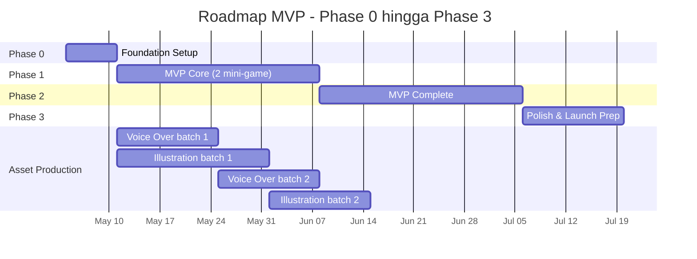

# Roadmap — Game Edukatif Anak

Pembagian fase pengembangan dari foundation hingga post-MVP, beserta milestone, estimasi waktu, dan kriteria selesai per fase.

> **Asumsi**: 1 developer full-time (sambil menyiapkan asset paralel). Estimasi bisa dipersingkat 30–50% dengan tim 2–3 orang.

---

## 1. Ringkasan Timeline

| Phase   | Durasi      | Fokus                                                  |
| ------- | ----------- | ------------------------------------------------------ |
| Phase 0 | 1 minggu    | Setup tooling, scaffold project                        |
| Phase 1 | 3–4 minggu  | MVP Core: 2 mini-game end-to-end                       |
| Phase 2 | 3–4 minggu  | MVP Complete: 5 mini-game lain + parent + onboarding   |
| Phase 3 | 2 minggu    | Polish, audio lengkap, PWA, UAT, launch prep           |
| **Total MVP** | **~10 minggu** | Siap launch internal/limited beta              |
| Phase 4+| Ongoing     | Post-MVP: Level 4–10, bilingual, multi-device          |

---

## 2. Phase 0 — Foundation (1 minggu)

**Tujuan**: project siap di-develop oleh tim, semua tooling jalan, "Hello World" end-to-end deployed.

### 2.1 Tasks

| #  | Task                                                                | Estimasi |
| -- | ------------------------------------------------------------------- | -------- |
| 1  | Init repo: `pnpm init`, `git init`, `.gitignore`, `README.md`       | 2j       |
| 2  | Setup TanStack Start dengan template TypeScript                     | 4j       |
| 3  | Integrasi Hono di route `/api/*`                                    | 4j       |
| 4  | Setup Prisma + SQLite, jalankan migrasi awal kosong                 | 3j       |
| 5  | Setup TailwindCSS + base styles                                     | 2j       |
| 6  | Setup BiomeJS config + format/lint                                  | 2j       |
| 7  | Setup Husky + pre-commit hook (biome check + tsc)                   | 2j       |
| 8  | Setup Vitest (unit) + Playwright (e2e) — minimal config             | 3j       |
| 9  | Setup Jotai store dasar + struktur `src/state/`                     | 2j       |
| 10 | Setup TanStack Router file-based routing                            | 3j       |
| 11 | Buat 1 endpoint dummy `GET /api/health` + tampilkan di FE          | 2j       |
| 12 | Setup deployment ke staging (Fly.io / Railway)                      | 4j       |
| 13 | Setup GitHub Actions CI: lint + typecheck + test + deploy preview   | 3j       |

### 2.2 Definition of Done

- [ ] `pnpm dev` jalan, app terbuka di localhost
- [ ] `pnpm build` sukses tanpa warning
- [ ] `pnpm test` jalan (minimal 1 test passing)
- [ ] Push ke main → otomatis deploy ke staging URL
- [ ] Skema Prisma kosong tapi bisa migrate
- [ ] Husky pre-commit aktif
- [ ] README.md ter-update dengan instruksi setup

### 2.3 Deliverable

- Repo siap clone & develop
- Staging URL aktif
- CI pipeline hijau

---

## 3. Phase 1 — MVP Core (3–4 minggu)

**Tujuan**: 2 mini-game (Huruf-Gambar Matching + Hitung Benda) bisa dimainkan end-to-end, dengan profil anak, dashboard sederhana, reward bintang+XP.

### 3.1 Sprint 1 (Minggu 2) — Data Layer & Profil

| #  | Task                                                          | Estimasi |
| -- | ------------------------------------------------------------- | -------- |
| 1  | Definisi Prisma schema lengkap (semua model)                  | 4j       |
| 2  | Migration + seed dasar (sticker catalog, badge catalog)       | 6j       |
| 3  | Seed 2 level pertama (`tk-literasi-1`, `tk-math-1`)           | 4j       |
| 4  | Endpoint `GET/POST /api/profiles` + `DELETE` (no auth dulu)   | 6j       |
| 5  | UI: Profile picker page (pilih anak + buat anak baru)         | 8j       |
| 6  | UI: Avatar gallery (8 avatar preset)                          | 4j       |
| 7  | UI: Pilih mode TK/SD-1 di buat profil                         | 3j       |
| 8  | Jotai atom: `currentChildId` (dengan persist localStorage)    | 2j       |
| 9  | Setup TanStack Query + apiClient wrapper                      | 4j       |

**Demo akhir sprint**: bisa buat profil anak baru, pilih avatar, masuk ke dashboard kosong.

### 3.2 Sprint 2 (Minggu 3) — Mini-game 1: Huruf-Gambar Matching

| #  | Task                                                          | Estimasi |
| -- | ------------------------------------------------------------- | -------- |
| 1  | UI komponen `HuruflGambarMatching` (drag & drop)              | 12j      |
| 2  | Logic gameplay: tracking score, mistakes, completion          | 6j       |
| 3  | Asset: 5 gambar (apel, bola, cangkir, durian, es krim) WebP   | 4j       |
| 4  | Endpoint `GET /api/activities/:id` (return seed activity)     | 3j       |
| 5  | Endpoint `POST .../activities/:id/submit` (basic)             | 6j       |
| 6  | Service `reward-engine.ts`: hitung bintang, XP                | 4j       |
| 7  | Service `mastery-engine.ts`: cek level mastery & unlock       | 4j       |
| 8  | UI: Result screen (bintang muncul, XP gained)                 | 6j       |
| 9  | Integrasi audio: SFX correct/wrong, click button              | 4j       |
| 10 | Unit test: reward-engine, mastery-engine                      | 6j       |

**Demo akhir sprint**: anak bisa main 1 mini-game lengkap, dapat bintang & XP, lihat di dashboard.

### 3.3 Sprint 3 (Minggu 4) — Mini-game 2: Hitung Benda + Dashboard

| #  | Task                                                          | Estimasi |
| -- | ------------------------------------------------------------- | -------- |
| 1  | UI komponen `HitungBenda`                                     | 10j      |
| 2  | Asset: gambar buah-buahan (8 jenis)                           | 4j       |
| 3  | Endpoint `GET /api/profiles/:id/dashboard` (full)             | 8j       |
| 4  | UI: Dashboard anak lengkap (XP, streak placeholder, quest)    | 12j      |
| 5  | UI: Level map per jalur (3 level visible, 1 unlocked)         | 8j       |
| 6  | Mascot Bimo placeholder (static SVG) di dashboard             | 3j       |
| 7  | Integrasi BGM dashboard (loop + ducking saat VO)              | 4j       |

**Demo akhir sprint**: full daily play loop bisa dimainkan untuk 2 mini-game di TK mode.

### 3.4 Sprint 4 (Minggu 5) — Polish Phase 1

| #  | Task                                                          | Estimasi |
| -- | ------------------------------------------------------------- | -------- |
| 1  | Bug fix dari Sprint 1–3                                       | 12j      |
| 2  | Voice-over batch 1 (instruksi + 5 generic feedback)           | 8j       |
| 3  | Animasi reward (Lottie confetti) di result screen             | 6j       |
| 4  | Responsive layout (tablet portrait, mobile)                   | 8j       |
| 5  | Demo internal + iterasi feedback                              | 4j       |

### 3.5 Definition of Done — Phase 1

- [ ] 2 mini-game (TK literasi + TK math) bisa dimainkan end-to-end
- [ ] Profil anak bisa create/list/select/delete
- [ ] Dashboard menampilkan XP, current level, quest hari ini
- [ ] Bintang & XP terhitung dengan benar (server-side)
- [ ] Level mastery ter-tracking
- [ ] VO dasar terintegrasi
- [ ] SFX dasar terintegrasi
- [ ] Test coverage >50% di reward-engine & mastery-engine
- [ ] Deployed ke staging, bisa di-demo

---

## 4. Phase 2 — MVP Complete (3–4 minggu)

**Tujuan**: lengkapi semua mini-game, mode SD-1, parent area, onboarding, streak, sticker album.

### 4.1 Sprint 5 (Minggu 6) — Mini-game 3, 4, 5

| #  | Task                                                          | Estimasi |
| -- | ------------------------------------------------------------- | -------- |
| 1  | UI `SusunSukuKata` (drag suku kata)                           | 10j      |
| 2  | UI `BandingkanLebihKurang`                                    | 8j       |
| 3  | UI `PenjumlahanVisual`                                        | 10j      |
| 4  | Asset: ilustrasi tambahan (~15 gambar baru)                   | 8j       |
| 5  | Seed 6 level baru (TK literasi 2-3, TK math 2-3, SD-1 awal)   | 6j       |

### 4.2 Sprint 6 (Minggu 7) — Mini-game 6, 7 + Mode SD-1

| #  | Task                                                          | Estimasi |
| -- | ------------------------------------------------------------- | -------- |
| 1  | UI `BacaKalimatPendek`                                        | 10j      |
| 2  | UI `PenguranganVisual`                                        | 8j       |
| 3  | Adjust UI per ageMode (font size, instruksi, dll.)            | 6j       |
| 4  | Seed level SD-1 lengkap (literasi 1-3, math 1-3)              | 6j       |
| 5  | Voice-over batch 2 (per aktivitas instruksi)                  | 12j      |

### 4.3 Sprint 7 (Minggu 8) — Parent Area

| #  | Task                                                          | Estimasi |
| -- | ------------------------------------------------------------- | -------- |
| 1  | Service `pin.ts` (hash dengan argon2 + verify)                | 4j       |
| 2  | Endpoint `/api/parent/setup-pin`, `verify-pin`, `change-pin`  | 6j       |
| 3  | Endpoint `/api/parent/settings` GET/PUT                       | 4j       |
| 4  | Endpoint `/api/parent/report/:childId`                        | 8j       |
| 5  | Endpoint `/api/parent/wellness/:childId`                      | 4j       |
| 6  | Middleware: parent session token (in-memory)                  | 4j       |
| 7  | UI: PIN setup screen (di onboarding)                          | 4j       |
| 8  | UI: PIN gate modal                                            | 6j       |
| 9  | UI: Parent dashboard (laporan per anak)                       | 12j      |
| 10 | UI: Parent settings (time cap, audio toggle)                  | 6j       |
| 11 | UI: Manage profiles (list, edit, delete via PIN)              | 6j       |

### 4.4 Sprint 8 (Minggu 9) — Onboarding, Streak, Sticker Album

| #  | Task                                                          | Estimasi |
| -- | ------------------------------------------------------------- | -------- |
| 1  | UI: Onboarding flow (welcome, buat profil, set PIN, tutorial) | 12j      |
| 2  | Service `streak-engine.ts` + endpoint update                  | 6j       |
| 3  | UI: Streak banner di dashboard                                | 4j       |
| 4  | Endpoint & UI: Sticker album page                             | 10j      |
| 5  | Random sticker drop logic (rarity weighted)                   | 6j       |
| 6  | Wellness flow: session start/heartbeat/end + break modal      | 12j      |
| 7  | Daily time cap enforcement                                    | 6j       |

### 4.5 Definition of Done — Phase 2

- [ ] Semua 7 jenis mini-game bisa dimainkan
- [ ] 12 level (3 × 2 × 2) seeded dengan minimal 1 aktivitas masing-masing
- [ ] Mode TK & SD-1 functional, anak bisa pilih
- [ ] Parent area lengkap dengan PIN
- [ ] Onboarding flow mulus untuk first-time user
- [ ] Streak counter berfungsi
- [ ] Sticker album functional
- [ ] Wellness: break reminder + daily cap berfungsi
- [ ] E2E test: full daily play loop + parent area
- [ ] Test coverage >60%

---

## 5. Phase 3 — Polish & Launch Prep (2 minggu)

**Tujuan**: kualitas siap launch, audio lengkap, PWA aktif, UAT dengan anak nyata, performance audit.

### 5.1 Sprint 9 (Minggu 10) — Audio Lengkap & PWA

| #  | Task                                                          | Estimasi |
| -- | ------------------------------------------------------------- | -------- |
| 1  | Voice-over batch 3: completion lines per aktivitas            | 8j       |
| 2  | BGM gameplay tambahan (variasi)                               | 4j       |
| 3  | Setup Workbox service worker                                  | 8j       |
| 4  | PWA manifest (icon, name, theme color)                        | 3j       |
| 5  | Install prompt UI                                             | 4j       |
| 6  | Test offline mode end-to-end                                  | 6j       |
| 7  | Mascot Lottie animation (idle, talking, celebrating)          | 12j      |
| 8  | Page transitions (Framer Motion)                              | 6j       |

### 5.2 Sprint 10 (Minggu 11) — Accessibility, Performance, UAT

| #  | Task                                                          | Estimasi |
| -- | ------------------------------------------------------------- | -------- |
| 1  | Accessibility audit (axe DevTools)                            | 6j       |
| 2  | Implementasi `prefers-reduced-motion` toggle                  | 3j       |
| 3  | Performance audit (Lighthouse)                                | 4j       |
| 4  | Bundle optimization (lazy load, code split, asset compress)   | 8j       |
| 5  | UAT dengan 3–5 anak (TK & SD) + observasi                     | 12j      |
| 6  | Iterasi berdasarkan UAT findings                              | 12j      |
| 7  | Privacy policy & terms (Bahasa Indonesia)                     | 4j       |
| 8  | Production deployment + DNS + HTTPS                           | 6j       |
| 9  | Backup strategy (cron daily SQLite copy)                      | 4j       |
| 10 | Smoke test production                                         | 4j       |

### 5.3 Definition of Done — MVP Launch

- [ ] Semua VO production quality (bukan dummy)
- [ ] Semua animasi mascot ter-implementasi
- [ ] PWA installable + offline mode
- [ ] Lighthouse score: Performance ≥85, Accessibility ≥95, Best Practices ≥90, PWA ≥90
- [ ] 0 critical bug dari UAT
- [ ] Privacy policy live
- [ ] Production deployed dengan custom domain + HTTPS
- [ ] Backup running
- [ ] Documentation: user guide untuk orang tua (optional 1-pager)

---

## 6. Phase 4+ — Post-MVP

Tidak ada timeline kaku, eksekusi berdasarkan prioritas & feedback.

### 6.1 Phase 4a — Konten Expansion (4 minggu)

- Tambah Level 4–7 untuk semua jalur
- Variasi soal lebih banyak (procedural soal sederhana untuk Penjumlahan/Pengurangan)
- Tambah jenis mini-game baru: Mengurutkan Bilangan, Pasangan Sinonim, Bunyi Huruf

### 6.2 Phase 4b — Personalization (3 minggu)

- Adaptive difficulty: jika anak terlalu cepat dapat 3 bintang konsisten, suggest level lebih tinggi
- Personalized quest harian berdasarkan jalur favorit
- Custom mascot color per anak

### 6.3 Phase 4c — Multi-Device & Cloud Sync (4 minggu)

- Tambah `ParentAccount` (email + password)
- Sync progres ke cloud (Turso atau PostgreSQL)
- QR code pair device

### 6.4 Phase 4d — Bilingual (2 minggu)

- i18n setup (sudah disiapkan di codebase)
- Konten Inggris untuk literasi (huruf, sight words, kalimat sederhana)
- Voice-over Inggris

### 6.5 Phase 4e — Konten Tematik (4 minggu)

- Tema mingguan (Kebun Binatang, Tata Surya, dll.)
- Mascot ber-kostum sesuai tema
- Special stiker per tema

### 6.6 Phase 4f — Analytics & Insights (3 minggu)

- Self-hosted PostHog atau Plausible
- Parent dashboard insights (area kuat/lemah anak, suggestion)
- Weekly progress report email (opt-in)

---

## 7. Risk Management & Buffer

### 7.1 Buffer Time

Setiap phase punya 20% buffer implicit dalam estimasi (untuk meeting, code review, debugging tak terduga).

### 7.2 Risiko Timeline & Mitigasi

| Risiko                                                         | Impact | Mitigasi                                                                       |
| -------------------------------------------------------------- | ------ | ------------------------------------------------------------------------------ |
| Voice-over production lambat (sewa talent)                     | High   | Pakai ElevenLabs API untuk MVP; rekam profesional di Phase 4+                  |
| Asset illustration produksi lambat                             | High   | Mulai dari open-source/CC0 + AI-generated dengan review; commission gradual    |
| TanStack Start masih beta / breaking changes                   | Medium | Pin versi spesifik di Phase 0; siapkan plan migrasi ke Next.js jika perlu      |
| UAT temukan critical UX issue                                  | Medium | Reserve 2 minggu untuk iterasi di Sprint 10                                    |
| Hosting biaya tak terduga                                      | Low    | Mulai dari Fly.io free tier; budget alert                                      |
| Tim kecil (1 dev) → bottleneck                                 | High   | Phase 0 setup lengkap supaya kontributor lain bisa onboard cepat               |

### 7.3 Cut Lines (Jika Timeline Mepet)

Prioritas yang bisa dipotong (urutan dari yang paling bisa dikorbankan):

1. **Phase 3 mascot Lottie animation** → ganti pakai SVG static (3 hari saved)
2. **Sticker album** → minimal viable: hanya popup saat dapat sticker baru, tidak perlu page album terpisah (5 hari saved)
3. **Streak counter** → defer ke Phase 4 (3 hari saved)
4. **Parent dashboard report** → simplify jadi list saja (5 hari saved)
5. **PWA offline** → defer ke post-launch update (5 hari saved)

Total cut potential: **~3 minggu**.

---

## 8. Milestone Summary

| Milestone     | Target Date (relatif) | Deliverable                                      |
| ------------- | --------------------- | ------------------------------------------------ |
| M0: Foundation | Week 1               | Repo siap, staging deployed, CI hijau            |
| M1: First Play | Week 4               | 1 mini-game complete, demo-able internal         |
| M2: Core Loop | Week 5                | 2 mini-game + dashboard + reward                 |
| M3: All Games | Week 7                | 7 mini-game functional                           |
| M4: Parent Ready | Week 8             | Parent area complete                             |
| M5: Beta Ready | Week 9               | Onboarding + streak + album, layak beta tester   |
| M6: MVP Launch | Week 11              | Production launch dengan limited beta            |
| M7: Public Release | Week 14 (after 3 weeks beta iteration) | Open public                |

---

## 9. Tim & Kapasitas (Asumsi)

### 9.1 Skenario A: Solo Developer

- 1 full-stack dev (asumsi pengetahuan: TS, React, Hono, Prisma)
- Estimasi total: **10 minggu** untuk MVP launch
- Risiko: bottleneck di production asset (gambar, audio)
- Mitigasi: outsource asset production via Fiverr/freelancer paralel

### 9.2 Skenario B: Tim Kecil (2–3 orang)

- 1 senior dev (FE/BE generalist)
- 1 junior dev / designer
- 1 part-time content creator (konten level + asset coordination)
- Estimasi total: **6–7 minggu** untuk MVP launch (paralel work)

### 9.3 Skenario C: Tim Lengkap (5+)

- 2 dev (FE specialist + FS/BE)
- 1 designer (UI + asset)
- 1 audio engineer / voice talent
- 1 content/curriculum specialist
- 1 PM / QA
- Estimasi total: **4 minggu** untuk MVP launch

---

## 10. Definition of "Launch Ready"

MVP siap launch jika **semua** ini terpenuhi:

- [ ] 7 mini-game functional di kedua mode
- [ ] 12 level seeded
- [ ] Onboarding mulus (5 anak baru bisa setup tanpa bantuan dewasa setelah dijelaskan sekali)
- [ ] Parent area: PIN, settings, report
- [ ] PWA installable
- [ ] Audio production quality
- [ ] Privacy policy live
- [ ] Lighthouse score memenuhi target
- [ ] UAT 3–5 anak: zero critical issue
- [ ] Backup strategy live
- [ ] On-call rotation (minimal email monitoring)

---

## 11. Open Questions / Decision Log

Hal-hal yang perlu diputuskan sebelum / di awal Phase 0:

- [ ] Voice talent: ElevenLabs vs profesional? (impact: Phase 1 audio quality)
- [ ] Hosting: Fly.io vs Railway vs VPS? (impact: deployment script)
- [ ] Content authoring: hardcode JSON vs admin panel kecil? (impact: Phase 4 content scale)
- [ ] Beta tester recruiting: lewat siapa? (sekolah partner? komunitas parenting?)
- [ ] Branding: nama final aplikasi (saat ini "Game Edukatif Anak" generic)?
- [ ] Logo & icon final
